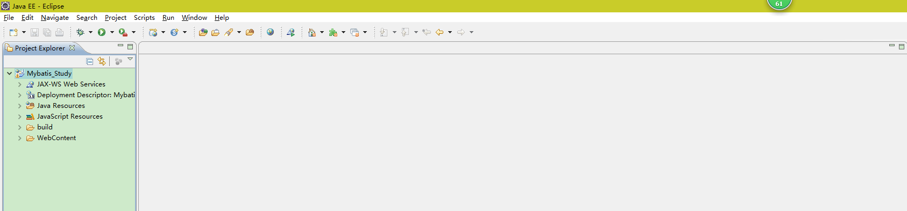
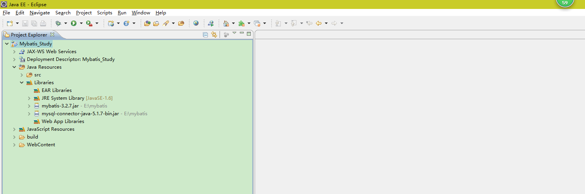
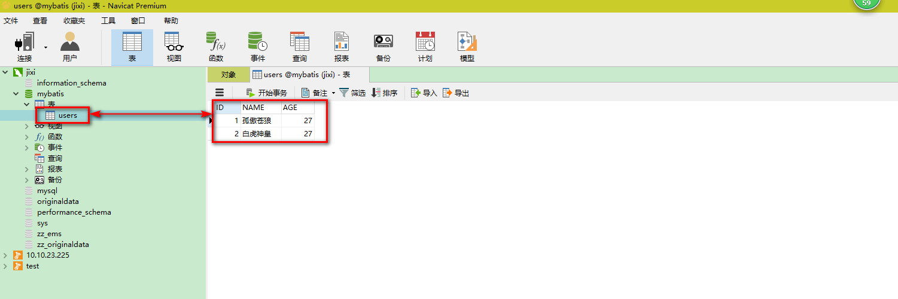
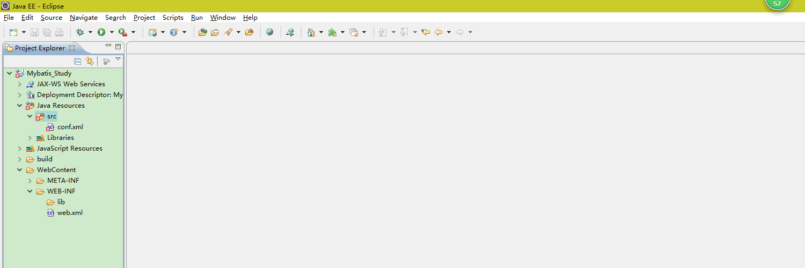
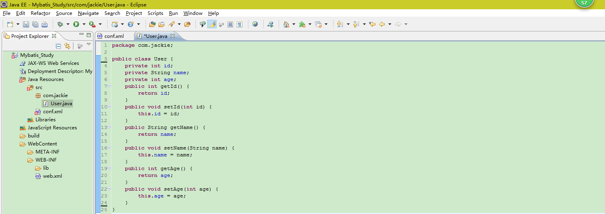
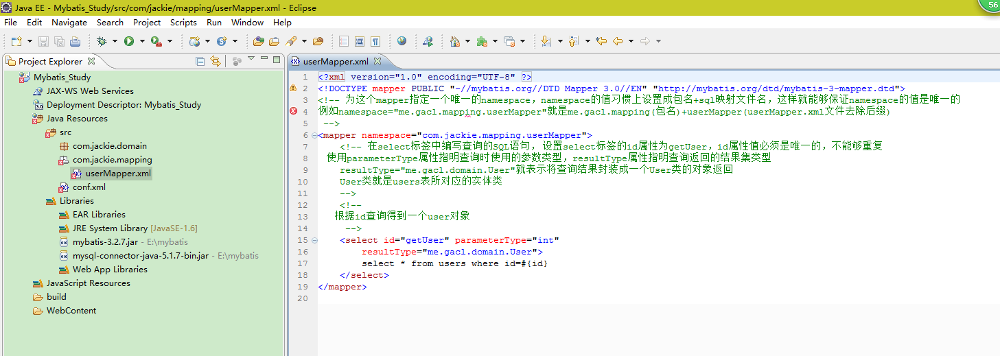
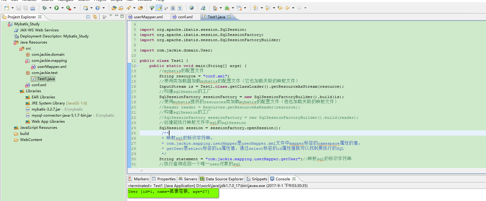

### 一：Mybatis介绍
&nbsp;&nbsp;&nbsp;&nbsp;&nbsp;&nbsp;&nbsp;&nbsp;Mybatis是一个支持普通SQL查询，存储过程和高级映射的优秀持久层框架。MyBatis消除了几乎所有的JDBC代码和参数的手工设置以及对结果集的检索封装。MaBatis可以使用简单的XML或注解用于配置和原始映射。将接口和Java的POJO（Plain Old Java Objects，普通的Java对象）映射成数据库中的记录。

### 二：MyBatis快速入门
- #### 1、准备开发环境

> - A:创建测试项目，普通Java项目或者是JavaWeb项目均可，如下图所示：

> 

> - B：添加相应的jar包

> 

> - C：创建数据库和表，针对MYSQL数据哭。SQL脚本如下：
```
CREATE DATABASE;
USE mybatis;
CREATE TABLE users(ID INT PRIMARY KEY AUTO_INCREMENT,NAME VARCHAR(20),AGE INT)
INSERT INTO `mybatis`.`users` (`NAME`, `AGE`) VALUES ( '孤傲苍狼', 27);
INSERT INTO `mybatis`.`users` (`NAME`, `AGE`) VALUES ( '白虎神皇', 27);
```

> 将SQL脚本在mysql数据库中执行，完成创建数据库和表的操作，如下：

> 

> 至此，前期的所有开发准备环境全部完成。

- #### 2、使用MyBatis查询表中的数据

> - A：添加Mybatis的配置文件conf.XML

> 在src目录下创建一个conf.xml文件，如下图所示：

> 

> conf配置文件的内容如下：

```
<?xml version="1.0" encoding="UTF-8"?>
<!DOCTYPE configuration PUBLIC "-//mybatis.org//DTD Config 3.0//EN" "http://mybatis.org/dtd/mybatis-3-config.dtd">
<configuration>
    <environments default="development">
        <environment id="development">
            <transactionManager type="JDBC" />
            <!-- 配置数据库连接信息 -->
            <dataSource type="POOLED">
                <property name="driver" value="com.mysql.jdbc.Driver" />
                <property name="url" value="jdbc:mysql://localhost:3306/mybatis" />
                <property name="username" value="root" />
                <property name="password" value="mysql" />
            </dataSource>
        </environment>
    </environments>
</configuration>
```

> - B：定义表对应的实体类，如下图所示：

> 

> user实体类的内容如下：

```
package com.jackie;

public class User {
	private int id;
	private String name;
	private int age;
	public int getId() {
		return id;
	}
	public void setId(int id) {
		this.id = id;
	}
	public String getName() {
		return name;
	}
	public void setName(String name) {
		this.name = name;
	}
	public int getAge() {
		return age;
	}
	public void setAge(int age) {
		this.age = age;
	}
	@Override
	public String toString() {
		return "User [id=" + id + ", name=" + name + ", age=" + age + "]";
	}
}
```

> - C：定义操作users表的sql映射文件userMapper.xml

> 创建一个com.jackie.mapping包，专门用于存放sql映射文件，在包中创建一个userMapper.xml文件，如下图所示：

> 

> userMapper.xml文件的内容如下：

```
<?xml version="1.0" encoding="UTF-8" ?>
<!DOCTYPE mapper PUBLIC "-//mybatis.org//DTD Mapper 3.0//EN" "http://mybatis.org/dtd/mybatis-3-mapper.dtd">
<!-- 为这个mapper指定一个唯一的namespace，namespace的值习惯上设置成包名+sql映射文件名，这样就能够保证namespace的值是唯一的
例如namespace="me.gacl.mapping.userMapper"就是me.gacl.mapping(包名)+userMapper(userMapper.xml文件去除后缀)
 -->
<mapper namespace="com.jackie.mapping.userMapper">
    <!-- 在select标签中编写查询的SQL语句， 设置select标签的id属性为getUser，id属性值必须是唯一的，不能够重复
    使用parameterType属性指明查询时使用的参数类型，resultType属性指明查询返回的结果集类型
    resultType="me.gacl.domain.User"就表示将查询结果封装成一个User类的对象返回
    User类就是users表所对应的实体类
    -->
    <!--
        根据id查询得到一个user对象
     -->
    <select id="getUser" parameterType="int"
        resultType="me.gacl.domain.User">
        select * from users where id=#{id}
    </select>
</mapper>

```

> - D:在conf.xml文件中注册userMapper.xml文件

```
<?xml version="1.0" encoding="UTF-8"?>
<!DOCTYPE configuration PUBLIC "-//mybatis.org//DTD Config 3.0//EN" "http://mybatis.org/dtd/mybatis-3-config.dtd">
<configuration>
    <environments default="development">
        <environment id="development">
            <transactionManager type="JDBC" />
            <!-- 配置数据库连接信息 -->
            <dataSource type="POOLED">
                <property name="driver" value="com.mysql.jdbc.Driver" />
                <property name="url" value="jdbc:mysql://localhost:3306/mybatis" />
                <property name="username" value="root" />
                <property name="password" value="XDP" />
            </dataSource>
        </environment>
    </environments>

    <mappers>
        <!-- 注册userMapper.xml文件，
        userMapper.xml位于me.gacl.mapping这个包下，所以resource写成me/gacl/mapping/userMapper.xml-->
        <mapper resource="me/gacl/mapping/userMapper.xml"/>
    </mappers>

</configuration>
```

> - E：编写测试代码，执行定义的select语句

> 创建一个Test1类，编写如下的测试代码：

```
package com.jackie.test;

import java.io.InputStream;

import org.apache.ibatis.session.SqlSession;
import org.apache.ibatis.session.SqlSessionFactory;
import org.apache.ibatis.session.SqlSessionFactoryBuilder;

import com.jackie.domain.User;

public class Test1 {
	public static void main(String[] args) {
		//mybatis的配置文件
		String resource = "conf.xml";
		//使用类加载器加载mybatis的配置文件（它也加载关联的映射文件）
		InputStream is = Test1.class.getClassLoader().getResourceAsStream(resource);
		//构建sqlSession的工厂
		SqlSessionFactory sessionFactory = new SqlSessionFactoryBuilder().build(is);
		//使用mybatis提供的resources类加载mybatis的配置文件（他也加载关联的映射文件）
		//Reader reader = Resources.getResourceAsReader(resource);
        //构建sqlSession的工厂
        //SqlSessionFactory sessionFactory = new SqlSessionFactoryBuilder().build(reader);
        //创建能执行映射文件中sql的sqlSession
		SqlSession session = sessionFactory.openSession();
		 /**
         * 映射sql的标识字符串，
         * com.jackie.mapping.userMapper是userMapper.xml文件中mapper标签的namespace属性的值，
         * getUser是select标签的id属性值，通过select标签的id属性值就可以找到要执行的SQL
         */
        String statement = "com.jackie.mapping.userMapper.getUser";//映射sql的标识字符串
        //执行查询返回一个唯一user对象的sql
        User user = session.selectOne(statement, 1);
        System.out.println(user);
	}

}
```

> 执行效果如下：

> 

### 三、使用Mybatis对表执行CRUD操作——基于XML的实现
- #### 1、定义映射xml文件
> userMapper.xml文件的内容如下：
