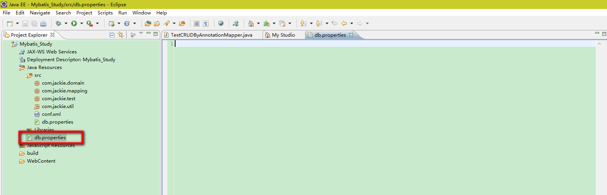

### 一：mybatis配置文件详解
&nbsp;&nbsp;&nbsp;&nbsp;&nbsp;&nbsp;&nbsp;&nbsp;MyBatis配置文件中大标签configuration下子标签包括如下：
> - properties
> - settings
> - typeAliases
> - typeHandlers
> - objectFactory
> - plugins
> - environments
> > - environment
> > > - transactionManager
> > > - dataSource
> - mappers

#### 1.properties属性
&nbsp;&nbsp;&nbsp;&nbsp;&nbsp;&nbsp;&nbsp;&nbsp;properties和java的properties的配置文件有关。配置properties的resource的路径，然后在properties标签下配置property的name和value，则可以替换properties文件中相应属性值。

> - A:在MyBatis配置文件中引用属性文件

&nbsp;&nbsp;&nbsp;&nbsp;&nbsp;&nbsp;&nbsp;&nbsp;MyBatis允许在mybatis-config.xml配置文件中加载*.properties属性文件，并使用属性文件的属性值，以提高应用的配置能力。例如在mybatis-config.xml文件所在目录创建config.properties，其内容如下：

```
mysql.driver = com.mysql.jdbc.Driver
mysql.url = jdbc:mysql://localhost:3306/test
mysql.username = root
mysql.password = lizhiwei
oracle.driver=oracle.jdbc.driver.OracleDriver
oracle.url=jdbc:oracle:thin:@127.0.0.1:1521:orcl
oracle.username=
oracle.password=
```

&nbsp;&nbsp;&nbsp;&nbsp;&nbsp;&nbsp;&nbsp;&nbsp; 在mybatis-config.xml文件中的使用如下：
```
<!-- 属性替换 -->
<properties resource="mysql.properties">
<property name="jdbc.driverClassName" value="com.mysql.jdbc.Driver"/>
<property name="jdbc.url" value="jdbc:mysql://localhost:3306/test"/>
<property name="username" value="root"/>
<property name="password" value="lizhiwei"/>
</properties>

```
> - B：使用代码加载属性
&nbsp;&nbsp;&nbsp;&nbsp;&nbsp;&nbsp;&nbsp;&nbsp;属性也可以被传递到SqlSessionBuilder.build()方法中。例如：

```
SqlSessionFactory factory = sqlSessionFactoryBuilder.build(reader, props);
// ... or ...
SqlSessionFactory factory = sqlSessionFactoryBuilder.build(reader, environment, props);
```
<font color="red">使用这种方法可以使用加密的属性文件!在不想让用户打开config.properties文件就知道用户密码时，对用户密码加密特别有用。</font>

> C：属性的加载顺序

&nbsp;&nbsp;&nbsp;&nbsp;&nbsp;&nbsp;&nbsp;&nbsp;如果属性在不止一个地方进行了配置，那么MyBatis将按照下面的顺序来加载：
> > - 在properties元素体内指定的属性首先被读取。
> > - 然后根据properties元素中的resource属性读取类路径下属性文件或根据url属性指定的路径读取属性文件，并覆盖以读取的同名属性，
> > - 最后兑取最为方法参数传递属性，并覆盖以读取的同名属性。

<font color="red">因此，通过方法参数传递的属性具有最高优先级，resource/url属性中指定的配置文件次之，最低优先级的是properties属性中指定的属性。</font>

#### 2.settings设置
&nbsp;&nbsp;&nbsp;&nbsp;&nbsp;&nbsp;&nbsp;&nbsp;这是MyBatis修改操作运行过程细节的重要的步骤。下方这个表格描述了这些设置项、含义和默认值。

|设置项|描述|允许值|默认值|
|---------|---------|---------|---------|
|cacheEnabled|对在此配置文件的所有cache进行全局性开/关设置|true/false|true|
|lazyLoadingEnabled|全局性设置懒加载。如果设为‘false’，则所有相关联的都会被初始化加载。|true/false|true|
|aggressiveLazyLoading|当设置为true的时候，懒加载的对象可能被任何懒属性全部加载。否则，每个属性都按需加载。|true/false|true|
|multipleResultSetsEnabled|允许和不允许单条语句返回数据集（取决于驱动需求）|true/false|true|
|useColumnLabel|使用列标签代替列名称。不同的驱动器有不同的作法。|true/false|true|
|useGeneratedKeys|允许JDBC生成主键。需要驱动器支持。如果设为了true，这个设置将强制使用被生成的主键，有一些驱动器不兼容不过仍然可以执行。|true/false|false|
|autoMappingBehavior|指定MyBatis是否并且如何来自动映射数据表字段与对象的属性。PARTIAL将只自动映射简单的，没有嵌套的结果。FULL将自动映射所有复杂的结果。|NONE.PARTIAL.FULL|PARTIAL|
|defaultExecutorType|配置和设定执行器，SIMPLE执行器执行其语句。REUSE执行器可能重复使用preparedstatements语句，BATCH执行器可以重复执行语句和批量更新。|SIMPLE.REUSE.BATCH|SIMPLE|
|defaultStatementTimeout|设置一个时限，以决定让驱动器等待数据库回应的多长时间为超时|正整数|Not Set（Null）|
|safeRowBoundsEnabled|Allows using RowBounds on nested statements|true/false|false|
|mapUnderscoreToCamelCase|Enables automatic mapping from classic database column names A_COLUMN to camel case classic Java property names aColumn.|true/false|false|
|localCacheScope|MyBatis uses local cache to prevent circular references and speed up repeated nested queries. By default (SESSION) all queries executed during a session are cached. If localCacheScope=STATEMENT local session will be used just for statement execution, no data will be shared between two different calls to the same SqlSession.	|SESSION/STATEMENT|SESSION|
|jdbcTypeForNull|Specifies the JDBC type for null values when no specific JDBC type was provided for the parameter. Some drivers require specifying the column JDBC type but others work with generic values like NULL, VARCHAR or OTHER.	|JdbcType enumeration. Most common are: NULL, VARCHAR and OTHER	|OTHER|
|lazyLoadTriggerMethods|Specifies which Object's methods trigger a lazy load	|A method name list separated by commas	|equals,clone,hashCode,toString|
|defaultScriptingLanguage|Specifies the language used by default for dynamic SQL generation.|A type alias or fully qualified class name.|org.apache.ibatis.scripting.xmltags.XMLDynamicLanguageDriver|
|logPrefix|Specifies the prefix string that MyBatis will add to the logger names.|Any String|NOT SET|
|logImpl|Specifies which logging implementation MyBatis should use. If this setting is not present logging implementation will be autodiscovered.|SLF4J /LOG4J /LOG4J2 /JDK_LOGGING/ COMMONS_LOGGING /STDOUT_LOGGING / NO_LOGGING|NOT SET|
|proxyFactory|Specifies the proxy tool that MyBatis will use for creating lazy loading capable objects.|CGLIB / JAVASSIST|CGLIB|

> settins配置示例：
> settings配置在mybatis-config.xml文件中，一个配置完整的 settings 元素的示例如下：

```
<settings>
    <setting name="cacheEnabled" value="true" />
    <setting name="lazyLoadingEnabled" value="true" />
    <setting name="multipleResultSetsEnabled" value="true" />
    <setting name="useColumnLabel" value="true" />
    <setting name="useGeneratedKeys" value="false" />
    <setting name="autoMappingBehavior" value="PARTIAL" />
    <setting name="defaultExecutorType" value="SIMPLE" />
    <setting name="defaultStatementTimeout" value="25" />
    <setting name="defaultFetchSize" value="100" />
    <setting name="safeRowBoundsEnabled" value="false" />
    <setting name="mapUnderscoreToCamelCase" value="false" />
    <setting name="localCacheScope" value="SESSION" />
    <setting name="jdbcTypeForNull" value="OTHER" />
    <setting name="lazyLoadTriggerMethods" value="equals,clone,hashCode,toString" />
</settings>
```

#### 3、typeAliases（类型别名）
> - A：MyBatis设置别名

&nbsp;&nbsp;&nbsp;&nbsp;&nbsp;&nbsp;&nbsp;&nbsp;给Java类型取一个别名，方便在核心配置、映射配置中来使用这个java类型。

> 类型别名是为Java类型设置一个短的名字。它只和XML配置有关，存在的意义仅在于用来减少类完全限定名的冗余。别名的设置可以通过配置文件或注解来定义。通过配置文件配置如下：(取自mybatis-config.xml文件)

```
<typeAliases>
	<typeAlias alias="Author" type="domain.blog.Author" />
	<typeAlias alias="Blog" type="domain.blog.Blog" />
	<typeAlias alias="Comment" type="domain.blog.Comment" />
	<typeAlias alias="Section" type="domain.blog.Section" />
</typeAliases>
```

> 当这样配置时，Blog可以用在任何使用domain.blog.Blog的地方。也可以指定一个包名，MyBatis会在包名下面搜索需要的Java Bean，比如:

```
<typeAliases>
	<package name="domain.blog" />
</typeAliases>
```

> 每一个在包domain.blog中的Java Bean，在没有注解的情况下，会使用Bean的首字母小写的非限定类名来作为它的别名。 比如domain.blog.Author的别名为author；若有注解，则别名为其注解值。看下面的例子：

```
@Alias("author")
public class Author {
    ...
}
```

> - B：MyBatis内置的别名定义说明

>  Mybatis已经为许多常见的 Java 类型内建了相应的类型别名。它们都是大小写不敏感的，需要注意的是由基本类型名称重复导致的特殊处理。参考如下表格：

|别名|映射的类型|别名|映射的类型|别名|映射的类型|别名|映射的类型|
|--|--|--|--|--|--|--|--|
|_byte|byte|_long|long|_short|short|_int|int|
|_integer|integer|_double|double|_float|float|_boolean|boolean|
|string|String|byte|Byte|long|Long|short|Short|
|int|Integer|integer|Integer|double|Double|float|Float|
|boolean|Boolean|date|Date|decimal|BigDecimal|bigdecimal|BigDecimal|
|object|Object|map|Map|hashmap|HashMap|list|List|
|arraylist|ArrayList|collection|Collection|iterator|Iterator|--|--|

#### 4、typeHandlers 类型处理器

> - A：typeHandlers介绍

> 无论是MyBatis在预处理语句（PreparedStatement）中设置一个参数时，还是从结果集中取出一个值时，都会用类型处理器将获取的值以合适的方式转换成Java类型。类型处理器就是把java类型转成数据库类型，把数据库类型转成java类型。

> 用途：
> - (1)获取数据库的值，以合适的方式转变为对应的java类型。
> - (2)将java类型，以合适的方式转化为数据库的保存类型。
> mybatis中默认的类型处理器：

|类型处理器|Java类型|JDBC类型|
|--|--|--|--|
|BooleanTypeHandler|java.lang.Boolean,boolean|任何兼容的布尔值|
|ByteTypeHandler|java.lang.Byte,byte|任何兼容的数字或字节类型|
|ShortTypeHandler|java.lang.Short,short|任何兼容的数字或短整型|
|IntegerTypeHandler|java.lang.Integer,int|任何兼容的数字和整型|
|LongTypeHandler|java.lang.Long,long|任何兼容的数字或长整型|
|FloatTypeHandler|java.lang.float,float|任何兼容的数字或单精度浮点型|
|DoubleTypeHandler|java.lang.Double,double|任何兼容的数字或双精度浮点型|
|BigDecimalTypeHandler|java.math.BigDecimal|任何兼容的数字或十进制小数类型|
|StringTypeHandler|java.lang.String|CHAR和VARCHAR类型|
|ClobTypeHandler|java.lang.String|CLOB和LONGVARCHAR类型|
|NStringTypeHandler|java.lang.String|NVARCHAR和CHAR类型|
|NClobTypeHandler|java.lang.String|NCLOB类型|
|ByteArrayTypeHandler|byte[]|任何兼容的字节流类型|
|BlobTypeHandler|byte[]|BLOB和LONGVARBINARY类型|
|DateTypeHandler|java.util.Date|TIMESTAMP类型|
|DateOnlyTypeHandler|java.util.Date|Date类型|
|TimeOnlyTypeHandler|java.util.Date|TIME类型|
|SqlTimestampTypeHandler|java.sql.Timestamp|TIMESTAMP 类型|
|SqlDateTypeHandler|java.sql.Date|DATE类型|
|SqlTimeTypeHandler|java.sql.Time|TIME 类型|
|ObjectTypeHandler|Any|其他或未指定类型|
|EnumTypeHandler|Enumeration Type|VARCHAR-任何兼容的字符串类型, 作为代码存储(而不是索引)|
|EnumOrdinalTypeHandler|Enumeration Type|Any compatible NUMERIC or DOUBLE, as the position is stored (not the code itself).|


> 可以重写类型处理器或创建你自己的类型处理器来处理不支持的或非标准的类型。 具体做法为：实现 org.apache.ibatis.type.TypeHandler 接口， 或继承一个很便利的类 org.apache.ibatis.type.BaseTypeHandler， 然后可以选择性地将它映射到一个 JDBC 类型。比如：

```
@MappedJdbcTypes(JdbcType.VARCHAR)
public class ExampleTypeHandler extends BaseTypeHandler<String>
{
    @Override
    public void setNonNullParameter(PreparedStatement ps, int i, String parameter, JdbcType jdbcType) throws SQLException
    {
        ps.setString(i, parameter);
    }
    @Override
    public String getNullableResult(ResultSet rs, String columnName) throws SQLException
    {
        return rs.getString(columnName);
    }
    @Override
    public String getNullableResult(ResultSet rs, int columnIndex) throws SQLException
    {
        return rs.getString(columnIndex);
    }
    @Override
    public String getNullableResult(CallableStatement cs, int columnIndex) throws SQLException
    {
        return cs.getString(columnIndex);
    }
}
```

> 在配置文件mybatis-config.xml中配置自定义的类型处理器如下：

```
<typeHandlers>
	<typeHandler handler="org.mybatis.example.ExampleTypeHandler" />
</typeHandlers>
```

<font color="red">使用这个的类型处理器将会覆盖已经存在的处理 Java 的 String 类型属性和 VARCHAR 参数及结果的类型处理器。 要注意 MyBatis 不会窥探数据库元信息来决定使用哪种类型，所以你必须在参数和结果映射中指明那是 VARCHAR 类型的字段， 以使其能够绑定到正确的类型处理器上。 这是因为：MyBatis 直到语句被执行才清楚数据类型。</font>

>  在设置类型处理器时也可以使用扫描包的方式，在配置文件mybatis-config.xml中如下配置：

```
<typeHandlers>
	<package name="org.mybatis.example" />
</typeHandlers>
```

<font color="red"> 注意：使用扫描包的方式注册类型处理器时，只能通过注解方式来指定 JDBC 的类型。</font>

> - B：设置类型处理器转换类型方法

> 通过类型处理器的泛型，MyBatis可以得知该类型处理器处理的Java类型，不过这种行为可以通过两种方法改变：
> * 在类型处理的配置元素（typeHandler element）上增加一个javaType属性（如：javaType=“String”）
> * 在类型处理器的类上（TypeHandler class）增加一个@MappedTypes注解来指定与其关联的Java类型列表。如果在 javaType 属性中也同时指定，则注解方式将被忽略。

> 可以通过两种方式来指定被关联的JDBC类型：
> - 在类型处理器的配置元素上增加一个javaType属性（比如：javaType=“VARCHAR”）
> - 在类型处理器的类上（TypeHandler class）增加一个@MappedJdbcTypes 注解来指定与其关联的 JDBC 类型列表。 如果在 javaType 属性中也同时指定，则注解方式将被忽略。

> - C：处理枚举类型
> 创建一个泛型类型处理器，它可以处理多于一个类。为达到此目的， 需要增加一个接收该类作为参数的构造器，这样在构造一个类型处理器的时候 MyBatis 就会传入一个具体的类。

```
public class GenericTypeHandler<E extends MyObject> extends BaseTypeHandler<E> {
  private Class<E> type;
  public GenericTypeHandler(Class<E> type) {
    if (type == null) throw new IllegalArgumentException("Type argument cannot be null");
    this.type = type;
  }
  ...
```

> EnumTypeHandler和EnumOrdinalTypeHandler都时泛型类型处理器（generic TypeHandlers）。若想映射枚举类型Enum，则需要从EnumTypeHandler或者EnumOrdinalTypeHandler最后哦给你选一个来使用。比如说我们想存储取近似值时用到的舍入模式。默认情况下，MyBatis会利用EnumTypeHandler来把Enum值转换成对应的名字。

<font color="red">注意：EnumTypeHandler在某种意义上来说是比较特别的，其他的处理器只针对某个特定的类，而它不同，它会处理任意继承了Enum的类。</font>

```
<!-- mybatis-config.xml -->
<typeHandlers>
	<typeHandler handler="org.apache.ibatis.type.EnumOrdinalTypeHandler" javaType="java.math.RoundingMode" />
</typeHandlers>
```
> 但是怎样能将同样的Enum既映射成字符串又映射成整型呢？自动映射器（auto-mapper）会自动地选用EnumOrdinalTypeHandler来处理，所以如果我们想用普通的EnumTypeHandler，就非要为那些SQL语句显示地设置要用到的类型处理器不可。

```
<!DOCTYPE mapper PUBLIC "-//mybatis.org//DTD Mapper 3.0//EN" "http://mybatis.org/dtd/mybatis-3-mapper.dtd">
<mapper namespace="org.apache.ibatis.submitted.rounding.Mapper">
	<resultMap type="org.apache.ibatis.submitted.rounding.User" id="usermap">
		<id column="id" property="id"/>
		<result column="name" property="name"/>
		<result column="funkyNumber" property="funkyNumber"/>
		<result column="roundingMode" property="roundingMode"/>
	</resultMap>
	<select id="getUser" resultMap="usermap">
		select * from users
	</select>
	<insert id="insert">
	    insert into users (id, name, funkyNumber, roundingMode) values (
	    	#{id}, #{name}, #{funkyNumber}, #{roundingMode}
	    )
	</insert>

	<resultMap type="org.apache.ibatis.submitted.rounding.User" id="usermap2">
		<id column="id" property="id"/>
		<result column="name" property="name"/>
		<result column="funkyNumber" property="funkyNumber"/>
		<result column="roundingMode" property="roundingMode" typeHandler="org.apache.ibatis.type.EnumTypeHandler"/>
	</resultMap>
	<select id="getUser2" resultMap="usermap2">
		select * from users2
	</select>
	<insert id="insert2">
	    insert into users2 (id, name, funkyNumber, roundingMode) values (
	    	#{id}, #{name}, #{funkyNumber}, #{roundingMode, typeHandler=org.apache.ibatis.type.EnumTypeHandler}
	    )
	</insert>
</mapper>
```

<font color="red">注意：这里的select语句强制使用resultMap来代替resultType。</font>

#### 5.objectFactory对象工厂
&nbsp;&nbsp;&nbsp;&nbsp;&nbsp;&nbsp;&nbsp;&nbsp;MyBatis每次创建结果对象的新实例时，它都会使用一个对象工厂（ObjectFactory）实例来完成。默认的对象工厂需要做的仅仅是实例化目标类，要么通过默认构造方法，要么在参数映射存在的时候通过参数构造方法来实例化。如果想覆盖对象工厂的默认行为，则可以通过创建自己的对象工厂来实现。比如：

```
// ExampleObjectFactory.java
public class ExampleObjectFactory extends DefaultObjectFactory
{
    public Object create(Class type)
    {
        return super.create(type);
    }
    public Object create(Class type, List<Class> constructorArgTypes, List<Object> constructorArgs)
    {
        return super.create(type, constructorArgTypes, constructorArgs);
    }
    public void setProperties(Properties properties)
    {
        super.setProperties(properties);
    }
    public <T> boolean isCollection(Class<T> type)
    {
        return Collection.class.isAssignableFrom(type);
    }
}
```

> 对象工厂的设置如下：

```
<!-- mybatis-config.xml -->
<objectFactory type="org.mybatis.example.ExampleObjectFactory">
    <property name="someProperty" value="100"/>
</objectFactory>
```

> objectFactory接口很简单，它包含两个创建对象的方法，一个是处理默认构造方法的，另外一个是处理带参数的构造方法。最后，setProperties方法可以被用来配置ObjectFactory，在初始化的ObjectFactory实例后，objectFactory元素体中定义的属性会被传递给setProperties方法。

#### 6、plugins插件
&nbsp;&nbsp;&nbsp;&nbsp;&nbsp;&nbsp;&nbsp;&nbsp;MyBatis允许以映射语句执行过程中的某一点进行拦截调用。默认情况下，MyBatis允许使用插件来拦截的方法调用包括：

> - Executor(update,query,flushStatements,commit,rollback,getTransaction,close.isClosed)
> - ParameterHandler(getParameterObject,setParameters)
> - ResultSetHandler(handleResultSets,handleOutputParameters)
> - StatementHandler(prepare,parameterize,batch,update,query)

&nbsp;&nbsp;&nbsp;&nbsp;&nbsp;&nbsp;&nbsp;&nbsp;这些类中方法的细节可以通过查看每个方法的签名来发现，或者直接查看MyBatis的发行包中的源代码。假设你想做的不仅仅是监控方法的调用，那么你应该很好的了解正在重写的方法的行为。因为如果在试图修改或重写已有方法的行为的时候，你很可能在破坏 MyBatis 的核心模块。 这些都是更低层的类和方法，所以使用插件的时候要特别当心。

&nbsp;&nbsp;&nbsp;&nbsp;&nbsp;&nbsp;&nbsp;&nbsp;通过MyBatis提供的强大机制，使用插件是非常简单的，只需实现Interceptor接口，并指定了想要拦截的方法签名即可。

```
// ExamplePlugin.java
@Intercepts({ @Signature(type = Executor.class, method = "update", args = { MappedStatement.class, Object.class }) })
public class ExamplePlugin implements Interceptor
{
    public Object intercept(Invocation invocation) throws Throwable
    {
        return invocation.proceed();
    }
    public Object plugin(Object target)
    {
        return Plugin.wrap(target, this);
    }
    public void setProperties(Properties properties)
    {
    }
}
```

> 插件的配置如下：

```
<!-- mybatis-config.xml -->
<plugins>
	<plugin interceptor="org.mybatis.example.ExamplePlugin">
		<property name="someProperty" value="100" />
	</plugin>
</plugins>
```

> 上面的插件将会拦截在 Executor 实例中所有的 “update” 方法调用， 这里的 Executor 是负责执行低层映射语句的内部对象。

<font color="red">注意：除了用插件来修改 MyBatis 核心行为之外，还可以通过完全覆盖配置类来达到目的。只需继承后覆盖其中的每个方法，再把它传递到 sqlSessionFactoryBuilder.build(myConfig) 方法即可。再次重申，这可能会严重影响 MyBatis 的行为，务请慎之又慎。</font>

### 7、environments环境

> - 1、环境配置介绍

> MyBatis可以配置成使用多种环境，这种机制有助于将SQL应用于多种数据库之中，现实情况又多种理由需要这么做。例如：开发。测试和生产环境需要有不同的配置；或者共享相同的SQL映射，许多类似的用例。

<font color="red">尽管可以配置多个环境，每个SqlSessionFactory实例只能选择其一。</font>

> 所以，如果你想连接两个数据库，就需要创建两个 SqlSessionFactory 实例，每个数据库对应一个。而如果是三个数据库，就需要三个实例，依此类推，记起来很简单：每个数据库对应一个 SqlSessionFactory 实例
> 为了指定创建哪种环境，只要将它作为可选的参数传递给 SqlSessionFactoryBuilder 即可。
> 可以接受环境配置的两个方法签名是：

```
SqlSessionFactory factory = sqlSessionFactoryBuilder.build(reader, environment);
SqlSessionFactory factory = sqlSessionFactoryBuilder.build(reader, environment,properties);
```
> 如果忽略了环境参数，那么默认环境将会被加载，如下所示：

```
SqlSessionFactory factory = sqlSessionFactoryBuilder.build(reader);
SqlSessionFactory factory = sqlSessionFactoryBuilder.build(reader,properties);
```

> 环境元素定义了如何配置环境，示例如下：

```
<environments default="development">
	<environment id="development">
		<transactionManager type="JDBC">
			<property name="..." value="..." />
		</transactionManager>
		<dataSource type="POOLED">
			<property name="driver" value="${driver}" />
			<property name="url" value="${url}" />
			<property name="username" value="${username}" />
			<property name="password" value="${password}" />
		</dataSource>
	</environment>
</environments>
```

<font color="red">注意关键点：</font>

> - 默认的环境ID（比如：default=“development”）
> - 每个environment元素定义的环境ID（比如：id="development"）
> - 事务管理器的配置（比如：type="JDBC"）
> - 数据源的配置（比如：type="POOLED"）

> 2、事务管理器（transactionManager）

&nbsp;&nbsp;&nbsp;&nbsp;&nbsp;&nbsp;&nbsp;&nbsp;在MyBatis中有两种类型的事务管理器（JDBC|MANAGED）
- JDBC这个配置就是直接使用了JDBC的提交和回滚设置，它依赖于从数据源得到的连接来管理事务范围。
- MANAGED这个配置几乎没做什么。它从来不提交或回滚一个连接，而是让容器来管理事务的整个生命周期（比如JEE应用服务器上下文）。默认情况下它会关闭连接，然而一些容器并不希望这样，因此需要将closeConnection属性设置false来阻止它默认的关闭行为。例如：

```
<transactionManager type="MANAGED">
	<property name="closeConnection" value="false" />
</transactionManager
```

&nbsp;&nbsp;&nbsp;&nbsp;&nbsp;&nbsp;&nbsp;&nbsp;<font color="red">注意：如果在使用Spring+MyBatis，则没有必要配置事务管理器，因为Spring模块会使用自带的管理器来覆盖前面的配置。</font>这两种事务管理器类型都不要任何属性。它们不过是类型别名，换句话说，可以使用TransactionFactory接口的实现类的完全限定名或类型别名代替它们。

```
public interface TransactionFactory
{
    void setProperties(Properties props);
    Transaction newTransaction(Connection conn);
    Transaction newTransaction(DataSource dataSource, TransactionIsolationLevel level, boolean autoCommit);
}
```

&nbsp;&nbsp;&nbsp;&nbsp;&nbsp;&nbsp;&nbsp;&nbsp;任何在XML中配置的属性在实例化之后将会被传递给setProperties()方法。需要创建一个Transaction接口的实现类，这个接口也很简单：

```
public interface Transaction
{
    Connection getConnection() throws SQLException;
    void commit() throws SQLException;
    void rollback() throws SQLException;
    void close() throws SQLException;
}
```

&nbsp;&nbsp;&nbsp;&nbsp;&nbsp;&nbsp;&nbsp;&nbsp;使用这两个接口，可以完全自定义MyBatis对事务的处理。

> 3、数据源（dataSource）
&nbsp;&nbsp;&nbsp;&nbsp;&nbsp;&nbsp;&nbsp;&nbsp;dataSource元素使用标准的JDBC数据源接口来配置JDBC连接对象的资源。<font color="red">许多 MyBatis 的应用程序将会按示例中的例子来配置数据源。然而它并不是必须的。要知道为了方便使用延迟加载，数据源才是必须的。</font>有三种内建的数据源类型（[UNPOOLED|POOLED|JNDI]）。

* 1、UNPOOLED

&nbsp;&nbsp;&nbsp;&nbsp;&nbsp;&nbsp;&nbsp;&nbsp;这个数据源的实现只是每次被请求时打开和关闭连接。虽然有一点慢，它对在及时可用连接方面没有性能要求的简单应用程序是一个很好的选择。不同的数据库在这方面表现也是不一样的，所以对某些数据库来说使用连接池并不重要，这个配置也是理想的。UNPOOLED类型的数据源仅仅需要配置以下五种属性：

- driver——这是JDBC驱动的Java类的完全限定名（并不是JDBC驱动中可能包含的数据源类）。
- url——这是数据库的JDBC URL地址。
- username——登录数据库的用户名。
- password——登录数据库的密码。
- defaultTransactionIsolationLevel——默认的连接事务隔离级别。

&nbsp;&nbsp;&nbsp;&nbsp;&nbsp;&nbsp;&nbsp;&nbsp;作为可选项，也可以传递属性给数据库驱动。要这样做，属性的前缀为“driver.”，例如：driver.encoding=UTF8。这将通过DriverManager.getConnection(url,driverProperties)方法传递值为UTF8的encoding属性给数据库驱动。
* 2.POOLED

&nbsp;&nbsp;&nbsp;&nbsp;&nbsp;&nbsp;&nbsp;&nbsp;这种数据源的实现利用“池”的概念将JDBC连接对象组织起来，避免了创建新的连接实例时所必须的初始化和认证时间。这是一种使得并发Web应用快速响应请求的流行处理方式。除了上述提到的UNPOOLED下的属性外。会有更多属性用来配置POOLED数据源：

- poolMaximunActiveConnetions——在任意时间可以存在的活动（也就是正在使用）连接数量。默认值：10
- poolMaximunIdleConnetions——任意时间可能存在的空闲数量
- poolMaximunCheckoutTime——再被强制返回之前，池中连接被检出（checked out）时间，默认值：20000毫秒（即20秒）
- poolTimeToWait——这是一个底层设置，如果获取连接话费的相当长的时间，它会给连接池打印状态日志并重新尝试获取一个连接（避免在误配置的情况下一直安静的失败），默认值：20000毫秒（即20秒）
- poolPingQuery——发送到数据库的侦测查询，用来检验连接是否处在正常工作秩序中并准备接受请求。默认时“NO PING QUERY SET”，这会导致多种数据库驱动失败时带有一个恰当的错误消息。
- poolPingEnabled——是否启用侦测查询。若开启，也必须使用一个可执行的SQL语句设置poolPingQuery属性（最好是一个非常快的SQL），默认值：false
- poolPingConnectionsNotUsedFor——配置poolPingQuery的使用频度。这可以被设置成匹配具体的数据连接超时时间，来避免不必要的侦测，默认值：0（即所有连接每一时刻都被侦测-当然仅当poolPingEnabled为true时适用）

* 3、JNDI

&nbsp;&nbsp;&nbsp;&nbsp;&nbsp;&nbsp;&nbsp;&nbsp;这个数据源的实现是为了能在如EJB或应用服务器这类容器中使用，容器可以集中或在外部配置数据源，然后放置一个JNDI上下文的引用。这种数据源配置只需要两个属性：

- initial_context——这个属性用来在InitialContext中寻找上下文（即initialContext.lookup(initial_context)）。这是个可选属性，如果忽略，那么data_source属性将会直接从InitialContext中寻找。
- data_source——这是引用数据源实例位置的上下文的路径。提供了initial_context配置时会在其返回的上下文中进行查找，没有提供时则直接在InitialContext中查找。

&nbsp;&nbsp;&nbsp;&nbsp;&nbsp;&nbsp;&nbsp;&nbsp;和其他数据源配置类似，可以通过添加前缀“env.”直接把属性传递给初始上下文。比如：env.encoding=UTF8.这就会在初始上下文（InitialContext）实例化时往它的构造方法传递值为UTF8的encoding属性。

> 4、使用第三方的数据源

&nbsp;&nbsp;&nbsp;&nbsp;&nbsp;&nbsp;&nbsp;&nbsp;通过需要实现接口org.apache.ibatis.datasource.DataSourceFactory,也可使用任何第三方数据源:

```
public interface DataSourceFactory
{
    void setProperties(Properties props);
    DataSource getDataSource();
}
```

&nbsp;&nbsp;&nbsp;&nbsp;&nbsp;&nbsp;&nbsp;&nbsp;org.apache.ibatis.datasource.unpooled.UnpooledDataSourceFactory可被用作父类来构建新的数据源适配器，比如下面这段插入C3P0数据源所必需的代码：

```
import org.apache.ibatis.datasource.unpooled.UnpooledDataSourceFactory;
import com.mchange.v2.c3p0.ComboPooledDataSource;
public class C3P0DataSourceFactory extends UnpooledDataSourceFactory
{
    public C3P0DataSourceFactory()
    {
        this.dataSource = new ComboPooledDataSource();
    }
}
```

&nbsp;&nbsp;&nbsp;&nbsp;&nbsp;&nbsp;&nbsp;&nbsp;为了令其工作，为每个需要MyBatis调用的setter方法中增加一个属性。下面是一个可以连接至PostgreSQL数据库的例子：

```
<dataSource type="org.myproject.C3P0DataSourceFactory">
	<property name="driver" value="org.postgresql.Driver" />
	<property name="url" value="jdbc:postgresql:mydb" />
	<property name="username" value="postgres" />
	<property name="password" value="root" />
</dataSource>
```

> 8、databaseIdProvider数据库厂标识

&nbsp;&nbsp;&nbsp;&nbsp;&nbsp;&nbsp;&nbsp;&nbsp;MyBatis可以根据不同的数据库厂商执行不同的语句，这种多厂商的支持是基于映射语句中的databaseId属性。MyBatis会加载不带databaseId属性和带有匹配当前数据库databaseId属性的所有语句。如果同时找到带有databaseId和不带databaseId的相同语句，则后者会被舍弃。为支持多厂商特性只要像下面这样在mybatis-config.xml文件中加入databaseIdProvider即可：

```
<databaseIdProvider type="DB_VENDOR" />
```

&nbsp;&nbsp;&nbsp;&nbsp;&nbsp;&nbsp;&nbsp;&nbsp;这里的DB_VENDOR会通过DatabaseMetaData#getDatabaseProductName()返回的字符串进行设置。由于通常情况下这个字符串都非常长而且相同产品的不同版本会返回不同的值，所以最好通过设置属性别名来使其变短，如下：

```
<databaseIdProvider type="DB_VENDOR">
	<property name="SQL Server" value="sqlserver" />
	<property name="DB2" value="db2" />
	<property name="Oracle" value="oracle" />
</databaseIdProvider>
```

&nbsp;&nbsp;&nbsp;&nbsp;&nbsp;&nbsp;&nbsp;&nbsp;在有 properties 时，DB_VENDOR databaseIdProvider 的将被设置为第一个能匹配数据库产品名称的属性键对应的值，如果没有匹配的属性将会设置为 “null”。 在这个例子中，如果 getDatabaseProductName() 返回“Oracle (DataDirect)”，databaseId 将被设置为“oracle”。

&nbsp;&nbsp;&nbsp;&nbsp;&nbsp;&nbsp;&nbsp;&nbsp;&nbsp;你可以通过实现接口 org.apache.ibatis.mapping.DatabaseIdProvider 并在 mybatis-config.xml 中注册来构建自己的 DatabaseIdProvider：

```
public interface DatabaseIdProvider
{
    void setProperties(Properties p);
    String getDatabaseId(DataSource dataSource) throws SQLException;
}
```

> 9、mappers映射器

&nbsp;&nbsp;&nbsp;&nbsp;&nbsp;&nbsp;&nbsp;&nbsp;既然MyBatis的行为已经由上述元素配置完了，我们现在就要定义SQL映射语句了。但是首先我们需要告诉MyBatis到哪里去找到这些语句。Java在自动查找这方面没有提供一个很好的方法，所以最佳的方式是告诉MyBatis到哪里去找映射文件。可以使用相对于类路径的资源引用，或完全限定资源定位符（包括file:...的URL），或类名和包名等。例如：

```
<!-- Using classpath relative resources -->
<mappers>
	<mapper resource="org/mybatis/builder/AuthorMapper.xml" />
	<mapper resource="org/mybatis/builder/BlogMapper.xml" />
	<mapper resource="org/mybatis/builder/PostMapper.xml" />
</mappers>
<!-- Using url fully qualified paths -->
<mappers>
	<mapper url="file:///var/mappers/AuthorMapper.xml" />
	<mapper url="file:///var/mappers/BlogMapper.xml" />
	<mapper url="file:///var/mappers/PostMapper.xml" />
</mappers>
<!-- Using mapper interface classes -->
<mappers>
	<mapper class="org.mybatis.builder.AuthorMapper" />
	<mapper class="org.mybatis.builder.BlogMapper" />
	<mapper class="org.mybatis.builder.PostMapper" />
</mappers>
<!-- Register all interfaces in a package as mappers -->
<mappers>
	<package name="org.mybatis.builder" />
</mappers>
```

### 二：连接数据库的配置单独放在一个properties文件中

> 之前，我们是直接将数据库的连接配置信息写在了MyBatis的conf.xml文件中，如下：

```
<?xml version="1.0" encoding="UTF-8"?>
<!DOCTYPE configuration PUBLIC "-//mybatis.org//DTD Config 3.0//EN"
                               "http://mybatis.org/dtd/mybatis-3-config.dtd">
<configuration>
    <environments default="development">
        <environment id="development">
            <transactionManager type="JDBC" />
            <!-- 配置数据库连接信息 -->
            <dataSource type="POOLED">
                <property name="driver" value="com.mysql.jdbc.Driver" />
                <property name="url" value="jdbc:mysql://localhost:3306/mybatis" />
                <property name="username" value="root" />
                <property name="password" value="XDP" />
            </dataSource>
        </environment>
    </environments>

</configuration>
```

> 其实我们完全可以将数据库的连接配置信息写在一个properties文件中，然后在conf.xml文件中引用properties文件，具体作法如下：

- 1、在src目录下创建一个db.properties文件，如下图所示：



> 在db.properties文件中编写连接数据库需要使用到的数据库驱动、连接URL地址、用户名、密码，如下：

```
driver = com.mysql.jdbc.Driver
url = jdbc:mysql://localhost:3306/mybatis
name = root
password = mysql
```

- 2、在MyBatis的conf.xml文件中引用db.properties文件，如下：

```
<?xml version="1.0" encoding="UTF-8"?>
<!DOCTYPE configuration PUBLIC "-//mybatis.org//DTD Config 3.0//EN" "http://mybatis.org/dtd/mybatis-3-config.dtd">
<configuration>

	<!--
	引用db.properties配置文件
	-->
	<properties resource = "db.properties" />

	<!--
		developmenmt：开发模式
		work：工作模式
	-->
    <environments default="development">
        <environment id="development">
            <transactionManager type="JDBC" />
            <!-- 配置数据库连接信息 -->
            <dataSource type="POOLED">
                <property name="driver" value="com.mysql.jdbc.Driver" />
                <property name="url" value="jdbc:mysql://localhost:3306/mybatis" />
                <property name="username" value="root" />
                <property name="password" value="mysql" />
            </dataSource>
        </environment>
    </environments>
    <mappers>
        <!-- 注册userMapper.xml文件，
        userMapper.xml位于com.jackie.mapping这个包下，所以resource写成me/gacl/mapping/userMapper.xml-->
        <mapper resource="com/jackie/mapping/userMapper.xml"/>
		<!--注册UserMapper映射接口-->
		<mapper class = "com.jackie.mapping.UserMapperI" />
    </mappers>

</configuration>
```

### 三：为实体类定义别名，简化sql映射xml文件中的引用

> 之前，我们在sql映射sql文件中的引用实体类时，需要写上实体类的全类名（包名—+类名），如下：

```
<!--创建用户-->
<insert id="add" parameterType="com.jackie.domain.User">
       insert into users(id,name,age) values(#{id},#{name},#{age})
   </insert>
```

> parameterType="com.jackie.domain.User"这里写的实体类User的全类名com.jackie.domain.User，每次都写这么长串内容挺麻烦的，而我们希望能够简写成下面的形式：

```
<insert id="addUser2" parameterType="_User">
    insert into users(name,age) values(#{name},#{age})
</insert>
```

> parameterType="_User"这样写就简单多了，为了达到这种效果，我们需要在conf.xml文件中为实体类="com.jackie.domain.User"定义一个别名为"_User"，具体做法如下：在conf.xml文件中<configuration></configuration>标签中添加如下配置：


```
<typeAliases>
    <typeAlias type="com.jackie.domain.User" alias="_User"/>
</typeAliases>
```

> 这样就可以为com.jackie.domain.User类定义了一个别名为_User，以后_User就代表了com.jackie.domain.User类，这样sql映射xml文件中的凡是需要引用me.gacl.domain.User类的地方都可以使用_User来代替，这就达到了一个简化实体类引用的目的。


> 除了可以使用<typeAlias type="com.jackie.domain.User" alias="_User"/>这种方式单独为某一个实体类设置别名之外，我们还可以使用如下的方式批量为某个包下的所有实体类设置别名，如下：

```
<!--配置实体类的别名，配置实体类别名的目的是为了在引用实体类时可以使用实体类的别名来代替实体类，达到简写的目的-->
<typeAliases>
  <!--为实体类com.jackie.domain.User配置一个别名_User-->
  <!--<typeAliases type="com.jackie.domain.User" alias="_User" />-->
  <!--为com.jackie.domain包下的所有实体类配置别名，MyBatis默认的设置别名的方式就是去除类所在的包后的简单的类名
  比如com.jackie.domain.User这个实体类的别名就会被设置成User-->
  <package name="com.jackie.domain" />
</typeAliases>
```

```
<package name="me.gacl.domain"/>就表示为这个包下面的所有实体类设置别名。MyBatis默认的设置别名的方式就是去除类所在的包后的简单的类名，比如me.gacl.domain.User这个实体类的别名就会被设置成User。
```
