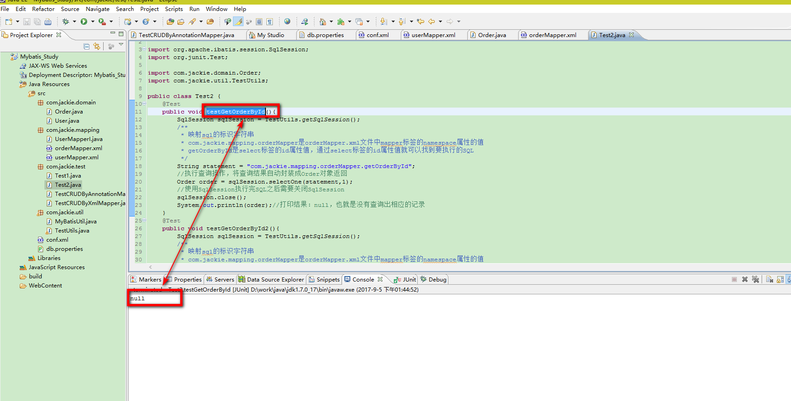
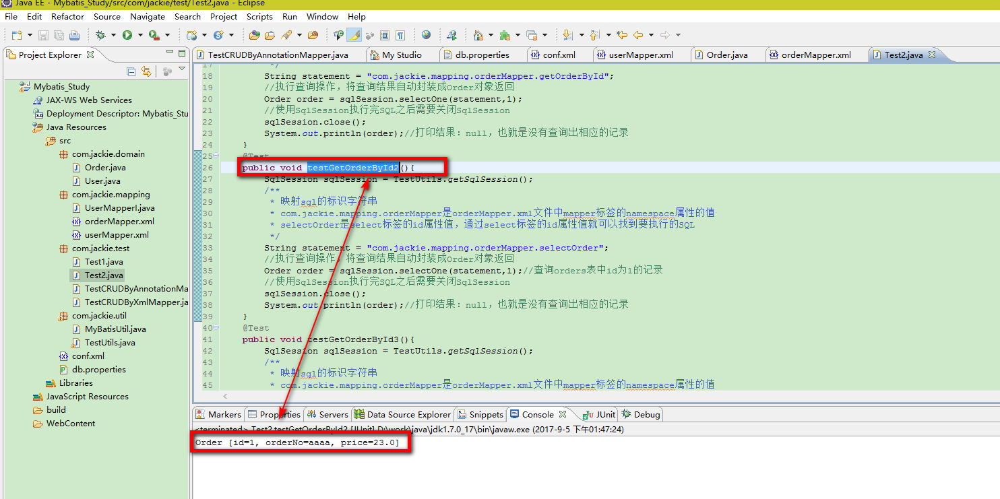
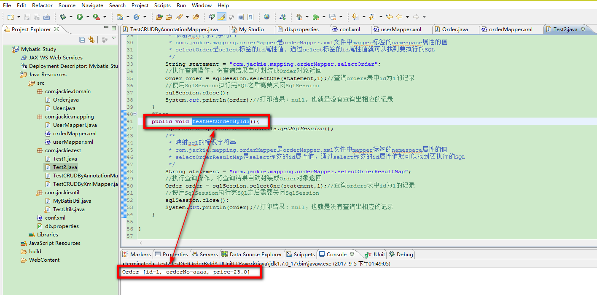

### 解决字段名与实体类属性名不相同的冲突

&nbsp;&nbsp;&nbsp;&nbsp;&nbsp;&nbsp;&nbsp;&nbsp;在平时的开发中，我们表中的字段名和表对应实体类的属性名称不一定都是完全相同的。

#### 1、准备演示需要使用的表和数据

```
CREATE TABLE orders(
    order_id INT PRIMARY KEY AUTO_INCREMENT,
    order_no VARCHAR(20),
    order_price FLOAT
);
INSERT INTO orders(order_no, order_price) VALUES('aaaa', 23);
INSERT INTO orders(order_no, order_price) VALUES('bbbb', 33);
INSERT INTO orders(order_no, order_price) VALUES('cccc', 22);
```

#### 2、定义实体类

```
package com.jackie.domain;

public class Order {

 /**
  * CREATE TABLE orders(
  *  order_id INT PRIMARY KEY AUTO_INCREMENT,
  * order_no VARCHAR(20),
  *  order_price FLOAT
  *	);
  */

 //Order实体类中属性名和orders表中的字段名是不一样的
 private int id; // id==>order_id
 private String orderNo; //orderNo==>order_no
 private float price; //price==>order_price
 public int getId() {
   return id;
 }
 public void setId(int id) {
   this.id = id;
 }
 public String getOrderNo() {
   return orderNo;
 }
 public void setOrderNo(String orderNo) {
   this.orderNo = orderNo;
 }
 public float getPrice() {
   return price;
 }
 public void setPrice(float price) {
   this.price = price;
 }
 @Override
 public String toString() {
   return "Order [id=" + id + ", orderNo=" + orderNo + ", price=" + price
       + "]";
 }
}

```

#### 3、编写测试代码
- A：编写SQL的xml映射文件
> 创建一个orderMapper.xml文件，orderMapper.xml的内容如下：

```
<?xml version="1.0" encoding="UTF-8"?>
<!DOCTYPE mapper
    PUBLIC "-//mybatis.org//DTD Mapper 3.0//EN"
    "http://mybatis.org/dtd/mybatis-3-mapper.dtd">

   <!--为这个mapper指定一个唯一的namespace，namespace的值习惯上设置成包名+sql映射文件名，这样就能够保证namespace的值是唯一的，例如
   namespace="com.jackie.mapping.orderMapper"就是com.jackie.mapping(包名)+orderMapper(orderMapper.xml文件去除后缀)-->		
<!-- namespace属性是名称空间，必须唯一 -->
<mapper namespace="com.jackie.mapping.orderMapper">
	<!--根据id查询得到一个order对象，使用这个查询是查询不到我们想要的结果的，
		这主要是因为实体类的属性名和数据库的字段名对应不上的原因，因此无法查询出对应的记录
	-->
	<select id="getOrderById" parameterType="int" resultType="com.jackie.domain.Order">
		select * from orders where order_id=#{id}
	</select>
	<!--根据id查询得到一个order对象，使用这个查询是可以正常查询到我们想要的结果的，这是
	因为我们将查询的字段名都起一个和实体类属性名相同的别名，这样实体类的属性名和查询结果中的字段名就可以意义对应上-->
	 <select id="selectOrder" parameterType="int"
        resultType="com.jackie.domain.Order">
        select order_id id, order_no orderNo,order_price price from orders where order_id=#{id}
    </select>
	<!--根据id查询得到一个order对象，使用这个查询是可以正常查询到我们想要的结果的，这是
	因为我们通过<resultMap>映射实体类属性名和表的字段名一一对应关系-->
	<select id="selectOrderResultMap" parameterType="int" resultMap="orderResultMap">
        select * from orders where order_id=#{id}
    </select>
	<!--通过<resultMap>映射实体类属性名和表的字段名对应关系-->
	<resultMap type="com.jackie.domain.Order" id="orderResultMap">
		<!--用id属性来映射主键字段-->
		<id property="id" column="order_id" />
		<!--用result属性来映射肥主键字段-->
		<result property="orderNo" column="order_no" />
		<result property="price" column="order_price" />
	</resultMap>
</mapper>
```

- B:在conf.xml文件中注册orderMapper.xml映射文件

```
<mappers>
  <!--注册orderMapper.xml文件-->
   <mapper resource="com/jackie/mapping/orderMapper.xml"/>
</mappers>
```

- C:编写测试代码

```
package com.jackie.test;

import org.apache.ibatis.session.SqlSession;
import org.junit.Test;

import com.jackie.domain.Order;
import com.jackie.util.TestUtils;

public class Test2 {
	@Test
	public void testGetOrderById(){
		SqlSession sqlSession = TestUtils.getSqlSession();
		/**
		 * 映射sql的标识字符串
		 * com.jackie.mapping.orderMapper是orderMapper.xml文件中mapper标签的namespace属性的值
		 * getOrderById是select标签的id属性值，通过select标签的id属性值就可以找到要执行的SQL
		 */
		String statement = "com.jackie.mapping.orderMapper.getOrderById";
		//执行查询操作，将查询结果自动封装成Order对象返回
		Order order = sqlSession.selectOne(statement,1);
		//使用SqlSession执行完SQL之后需要关闭SqlSession
		sqlSession.close();
		System.out.println(order);//打印结果：null，也就是没有查询出相应的记录
	}
	@Test
	public void testGetOrderById2(){
		SqlSession sqlSession = TestUtils.getSqlSession();
		/**
		 * 映射sql的标识字符串
		 * com.jackie.mapping.orderMapper是orderMapper.xml文件中mapper标签的namespace属性的值
		 * selectOrder是select标签的id属性值，通过select标签的id属性值就可以找到要执行的SQL
		 */
		String statement = "com.jackie.mapping.orderMapper.selectOrder";
		//执行查询操作，将查询结果自动封装成Order对象返回
		Order order = sqlSession.selectOne(statement,1);//查询orders表中id为1的记录
		//使用SqlSession执行完SQL之后需要关闭SqlSession
		sqlSession.close();
		System.out.println(order);//打印结果：null，也就是没有查询出相应的记录
	}
	@Test
	public void testGetOrderById3(){
		SqlSession sqlSession = TestUtils.getSqlSession();
		/**
		 * 映射sql的标识字符串
		 * com.jackie.mapping.orderMapper是orderMapper.xml文件中mapper标签的namespace属性的值
		 * selectOrderResultMap是select标签的id属性值，通过select标签的id属性值就可以找到要执行的SQL
		 */
		String statement = "com.jackie.mapping.orderMapper.selectOrderResultMap";
		//执行查询操作，将查询结果自动封装成Order对象返回
		Order order = sqlSession.selectOne(statement,1);//查询orders表中id为1的记录
		//使用SqlSession执行完SQL之后需要关闭SqlSession
		sqlSession.close();
		System.out.println(order);//打印结果：null，也就是没有查询出相应的记录
	}

}

```
> 测试一运行结果如下：


> 测试二运行结果如下：


> 测试三运行结果如下：


#### 4、总结
&nbsp;&nbsp;&nbsp;&nbsp;&nbsp;&nbsp;&nbsp;&nbsp;上面的测试代码演示当实体类中的属性名和表中的字段名不一致时，使用MyBatis进行查询操作时无法查询出相应的结果的问题以及针对问题采用的两种方法：
* <font color="red">解决方法一：</font>通过在查询的sql语句种定义字段名的别名，让字段名的别名和实体类的属性名一致，这样就可以表的字段名和实体类的属性名一一对应上了，这种方式是通过在sql语句中定义别名来解决字段名和属性名的映射关系的。
* <font color="red">解决方法二：</font>通过<resultMap>来映射字段名和实体类属性名的一一对应关系。这种方式时使用MyBatis提供的解决方式来解决字段名和属性名的映射关系的。
