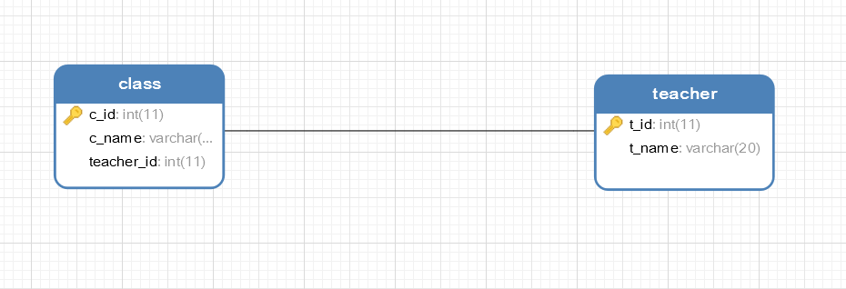
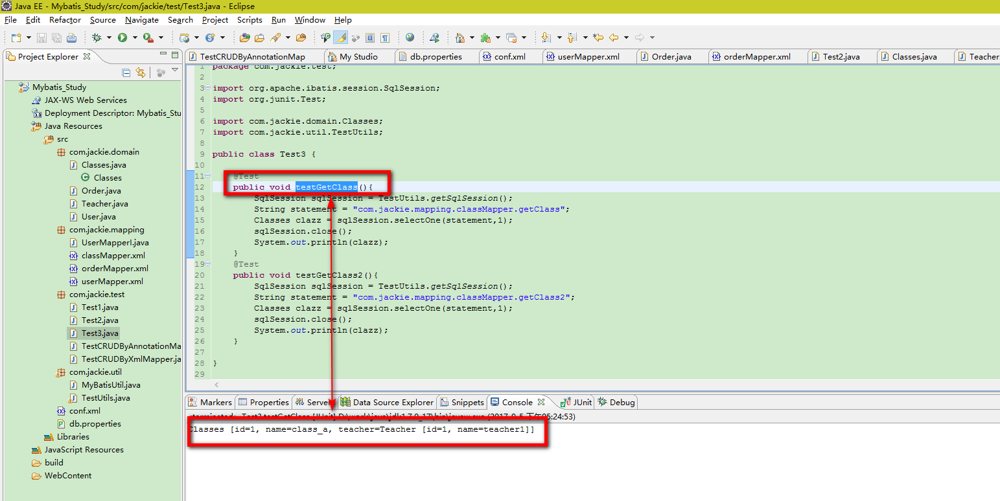
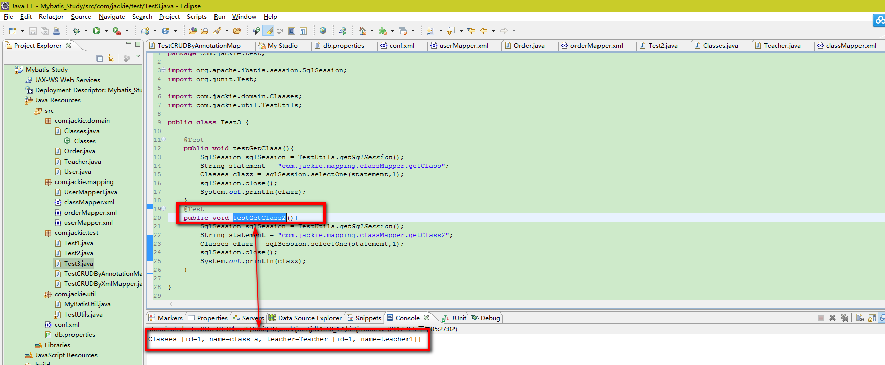
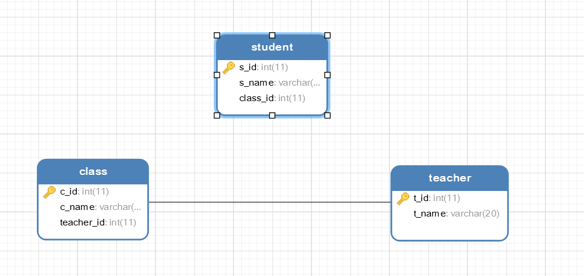
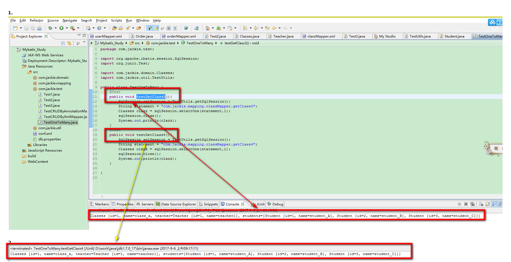

### 一：一对一关联

#### 1.提出需求

&nbsp;&nbsp;&nbsp;&nbsp;&nbsp;&nbsp;&nbsp;&nbsp;根据班级id查询班级信息（带老师的信息）

#### 2.创建表和数据
&nbsp;&nbsp;&nbsp;&nbsp;&nbsp;&nbsp;&nbsp;&nbsp;创建一张教师表和班级表，这是我们假设一个老师只负责一个班，那么老师和班级之间的关系就是一种一对一的关系。

```
CREATE TABLE teacher(
    t_id INT PRIMARY KEY AUTO_INCREMENT,
    t_name VARCHAR(20)
);
CREATE TABLE class(
    c_id INT PRIMARY KEY AUTO_INCREMENT,
    c_name VARCHAR(20),
    teacher_id INT
);
ALTER TABLE class ADD CONSTRAINT fk_teacher_id FOREIGN KEY (teacher_id) REFERENCES teacher(t_id);    

INSERT INTO teacher(t_name) VALUES('teacher1');
INSERT INTO teacher(t_name) VALUES('teacher2');

INSERT INTO class(c_name, teacher_id) VALUES('class_a', 1);
INSERT INTO class(c_name, teacher_id) VALUES('class_b', 2);
```

> 表之间的关系如下：



#### 3、定义实体类

A：class类

```
package com.jackie.domain;

public class Classes {
	//定义实体类中的属性，与class表中的字段一一对应
	private int id;//id==>c_id
	private String name;//name==>c_name

	private Teacher teacher;

	public int getId() {
		return id;
	}

	public void setId(int id) {
		this.id = id;
	}

	public String getName() {
		return name;
	}

	public void setName(String name) {
		this.name = name;
	}

	public Teacher getTeacher() {
		return teacher;
	}

	public void setTeacher(Teacher teacher) {
		this.teacher = teacher;
	}

	@Override
	public String toString() {
		return "Classes [id=" + id + ", name=" + name + ", teacher=" + teacher
				+ "]";
	}

}
```

B：teacher类

```
package com.jackie.domain;

public class Teacher {

	//定义实体类中的属性，与teacher表中的字段一一对应
	private int id; //id ==>t_id
	private String name; //name ==>t_name
	public int getId() {
		return id;
	}
	public void setId(int id) {
		this.id = id;
	}
	public String getName() {
		return name;
	}
	public void setName(String name) {
		this.name = name;
	}
	@Override
	public String toString() {
		return "Teacher [id=" + id + ", name=" + name + "]";
	}
}

```

#### 4、定义sql映射文件classMapper.xml

```
<?xml version="1.0" encoding="UTF-8"?>
<!DOCTYPE mapper
    PUBLIC "-//mybatis.org//DTD Mapper 3.0//EN"
    "http://mybatis.org/dtd/mybatis-3-mapper.dtd">


<!-- namespace属性是名称空间，必须唯一 -->
<mapper namespace="com.jackie.mapping.classMapper">
     <!--
        根据班级id查询班级信息(带老师的信息)
        ##1. 联表查询
        SELECT * FROM class c,teacher t WHERE c.teacher_id=t.t_id AND c.c_id=1;

        ##2. 执行两次查询
        SELECT * FROM class WHERE c_id=1;  //teacher_id=1
        SELECT * FROM teacher WHERE t_id=1;//使用上面得到的teacher_id
     -->

    <!--
    	方式一：嵌套结果：使用嵌套结果映射来处理重复的联合结果的子集
             封装联表查询的数据(去除重复的数据)
        select * from class c, teacher t where c.teacher_id=t.t_id and c.c_id=1
    -->
    <select id="getClass" parameterType="int" resultMap="ClassResultMap">
        select * from class c, teacher t where c.teacher_id=t.t_id and c.c_id=#{id}
    </select>
    <!-- 使用resultMap映射实体类和字段之间的一一对应关系 -->
    <resultMap type="com.jackie.domain.Classes" id="ClassResultMap">
        <id property="id" column="c_id"/>
        <result property="name" column="c_name"/>
        <association property="teacher" javaType="com.jackie.domain.Teacher">
            <id property="id" column="t_id"/>
            <result property="name" column="t_name"/>
        </association>
    </resultMap>

    <!--
    方式二：嵌套查询：通过执行另外一个SQL映射语句来返回预期的复杂类型
        SELECT * FROM class WHERE c_id=1;
        SELECT * FROM teacher WHERE t_id=1   //1 是上一个查询得到的teacher_id的值
    -->
     <select id="getClass2" parameterType="int" resultMap="ClassResultMap2">
        select * from class where c_id=#{id}
     </select>
     <!-- 使用resultMap映射实体类和字段之间的一一对应关系 -->
     <resultMap type="com.jackie.domain.Classes" id="ClassResultMap2">
        <id property="id" column="c_id"/>
        <result property="name" column="c_name"/>
        <association property="teacher" column="teacher_id" select="getTeacher"/>
     </resultMap>

     <select id="getTeacher" parameterType="int" resultType="com.jackie.domain.Teacher">
        SELECT t_id id, t_name name FROM teacher WHERE t_id=#{id}
     </select>
</mapper>
```

####　5、在conf.xml文件中注册classMapper.xml


```
<mappers>
    <!--注册classMapper.xml文件-->
    <mapper resource="com/jackie/mapping/classMapper.xml"/>
</mappers>
```

#### 6、编写单元测试代码

```
package com.jackie.test;

import org.apache.ibatis.session.SqlSession;
import org.junit.Test;

import com.jackie.domain.Classes;
import com.jackie.util.TestUtils;

public class Test3 {

	@Test
	public void testGetClass(){
		SqlSession sqlSession = TestUtils.getSqlSession();
		String statement = "com.jackie.mapping.classMapper.getClass";
		Classes clazz = sqlSession.selectOne(statement,1);
		sqlSession.close();
		System.out.println(clazz);
	}
	@Test
	public void testGetClass2(){
		SqlSession sqlSession = TestUtils.getSqlSession();
		String statement = "com.jackie.mapping.classMapper.getClass2";
		Classes clazz = sqlSession.selectOne(statement,1);
		sqlSession.close();
		System.out.println(clazz);
	}

}
```
> 运行结果如下：





#### 7、一对一对应关系总结
&nbsp;&nbsp;&nbsp;&nbsp;&nbsp;&nbsp;&nbsp;&nbsp;MyBatis中使用association标签来解决一对一的关联查询，association标签可用的属性如下：

* <font color="yellow">property</font>：对象属性的名称
* <font color="yellow">type</font>：对象属性的类型
* <font color="yellow">column</font>：所对应的外键字段名称
* <font color="yellow">select</font>：使用另一个查询封装的结果

### 二、一对多关联
#### 1、提出需求
&nbsp;&nbsp;&nbsp;&nbsp;&nbsp;&nbsp;&nbsp;&nbsp;根据classId查询对应的班级信息，包括学生，老师
#### 2、创建表和数据
&nbsp;&nbsp;&nbsp;&nbsp;&nbsp;&nbsp;&nbsp;&nbsp;创建一张班级表、教师表和学生表

```
CREATE TABLE teacher(
    t_id INT PRIMARY KEY AUTO_INCREMENT,
    t_name VARCHAR(20)
);
CREATE TABLE class(
    c_id INT PRIMARY KEY AUTO_INCREMENT,
    c_name VARCHAR(20),
    teacher_id INT
);
ALTER TABLE class ADD CONSTRAINT fk_teacher_id FOREIGN KEY (teacher_id) REFERENCES teacher(t_id);    
CREATE TABLE student(
    s_id INT PRIMARY KEY AUTO_INCREMENT,
    s_name VARCHAR(20),
    class_id INT
);
INSERT INTO student(s_name, class_id) VALUES('student_A', 1);
INSERT INTO student(s_name, class_id) VALUES('student_B', 1);
INSERT INTO student(s_name, class_id) VALUES('student_C', 1);
INSERT INTO student(s_name, class_id) VALUES('student_D', 2);
INSERT INTO student(s_name, class_id) VALUES('student_E', 2);
INSERT INTO student(s_name, class_id) VALUES('student_F', 2);
INSERT INTO teacher(t_name) VALUES('teacher1');
INSERT INTO teacher(t_name) VALUES('teacher2');

INSERT INTO class(c_name, teacher_id) VALUES('class_a', 1);
INSERT INTO class(c_name, teacher_id) VALUES('class_b', 2);
```

> 表之间的关系如下所示：



#### 3、定义实体类
* 1、定义学生实体类

```
package com.jackie.domain;


public class Student {
	private int id;
	private String name;
	public int getId() {
		return id;
	}
	public void setId(int id) {
		this.id = id;
	}
	public String getName() {
		return name;
	}
	public void setName(String name) {
		this.name = name;
	}
	@Override
	public String toString() {
		return "Student [id=" + id + ", name=" + name + "]";
	}
}
```

* 2、修改classes实体类，添加一个List<Student> students属性，使用一个List<Student>集合属性表示班级拥有的学生，如下：

```
package com.jackie.domain;

import java.util.List;

public class Classes {
	//定义实体类中的属性，与class表中的字段一一对应
	private int id;//id==>c_id
	private String name;//name==>c_name

	/**
	 * class表中有一个个teacher_id字段，所以在classes类中定义了一个teacher属性
	 * 用于维护teacher和class之间的一对一关系，通过这个teacher属性就可以知道这个班级是由哪个老师负责的
	 * @return
	 */
	private Teacher teacher;
	//使用一个List<Student>集合属性表示班级拥有的学生
	private List<Student> students;
	public List<Student> getStudents() {
		return students;
	}

	public void setStudents(List<Student> students) {
		this.students = students;
	}

	public int getId() {
		return id;
	}

	public void setId(int id) {
		this.id = id;
	}

	public String getName() {
		return name;
	}

	public void setName(String name) {
		this.name = name;
	}

	public Teacher getTeacher() {
		return teacher;
	}

	public void setTeacher(Teacher teacher) {
		this.teacher = teacher;
	}

	@Override
	public String toString() {
		return "Classes [id=" + id + ", name=" + name + ", teacher=" + teacher
				+ ", students=" + students + "]";
	}

}
```

#### 4、修改sql映射文件classMapper.xml
&nbsp;&nbsp;&nbsp;&nbsp;&nbsp;&nbsp;&nbsp;添加如下的SQL映射信息：

```
<!--
        根据classId查询对应的班级信息,包括学生,老师
     -->
    <!--
    方式一: 嵌套结果: 使用嵌套结果映射来处理重复的联合结果的子集
    SELECT * FROM class c, teacher t,student s WHERE c.teacher_id=t.t_id AND c.C_id=s.class_id AND  c.c_id=1
     -->
    <select id="getClass3" parameterType="int" resultMap="ClassResultMap3">
        select * from class c, teacher t,student s where c.teacher_id=t.t_id and c.C_id=s.class_id and  c.c_id=#{id}
    </select>
    <resultMap type="com.jackie.domain.Classes" id="ClassResultMap3">
        <id property="id" column="c_id"/>
        <result property="name" column="c_name"/>
        <association property="teacher" column="teacher_id" javaType="com.jackie.domain.Teacher">
            <id property="id" column="t_id"/>
            <result property="name" column="t_name"/>
        </association>
        <!-- ofType指定students集合中的对象类型 -->
        <collection property="students" ofType="com.jackie.domain.Student">
            <id property="id" column="s_id"/>
            <result property="name" column="s_name"/>
        </collection>
    </resultMap>

    <!--
        方式二：嵌套查询：通过执行另外一个SQL映射语句来返回预期的复杂类型
            SELECT * FROM class WHERE c_id=1;
            SELECT * FROM teacher WHERE t_id=1   //1 是上一个查询得到的teacher_id的值
            SELECT * FROM student WHERE class_id=1  //1是第一个查询得到的c_id字段的值
     -->
     <select id="getClass4" parameterType="int" resultMap="ClassResultMap4">
        select * from class where c_id=#{id}
     </select>
     <resultMap type="com.jackie.domain.Classes" id="ClassResultMap4">
        <id property="id" column="c_id"/>
        <result property="name" column="c_name"/>
        <association property="teacher" column="teacher_id" javaType="com.jackie.domain.Teacher" select="getTeacher2"></association>
        <collection property="students" ofType="com.jackie.domain.Student" column="c_id" select="getStudent"></collection>
     </resultMap>

     <select id="getTeacher2" parameterType="int" resultType="com.jackie.domain.Teacher">
        SELECT t_id id, t_name name FROM teacher WHERE t_id=#{id}
     </select>

     <select id="getStudent" parameterType="int" resultType="com.jackie.domain.Student">
        SELECT s_id id, s_name name FROM student WHERE class_id=#{id}
     </select>
```

#### 5、编写单元测试代码


```
package com.jackie.test;

import org.apache.ibatis.session.SqlSession;
import org.junit.Test;

import com.jackie.domain.Classes;
import com.jackie.util.TestUtils;

public class TestOneToMany {
	@Test
	public void testGetClass3(){
		SqlSession sqlSession = TestUtils.getSqlSession();
		String statement = "com.jackie.mapping.classMapper.getClass3";
		Classes clazz = sqlSession.selectOne(statement,1);
		sqlSession.close();
		System.out.println(clazz);
	}
	@Test
	public void testGetClass4(){
		SqlSession sqlSession = TestUtils.getSqlSession();
		String statement = "com.jackie.mapping.classMapper.getClass4";
		Classes clazz = sqlSession.selectOne(statement,1);
		sqlSession.close();
		System.out.println(clazz);
	}

}
```

> 运行结果如下：



#### 6、一对多关联总结
&nbsp;&nbsp;&nbsp;&nbsp;&nbsp;&nbsp;&nbsp;&nbsp;&nbsp;MyBatis中使用collection标签来解决一对多的关联查询，ofType属性指定集合中元素的对象类型。
