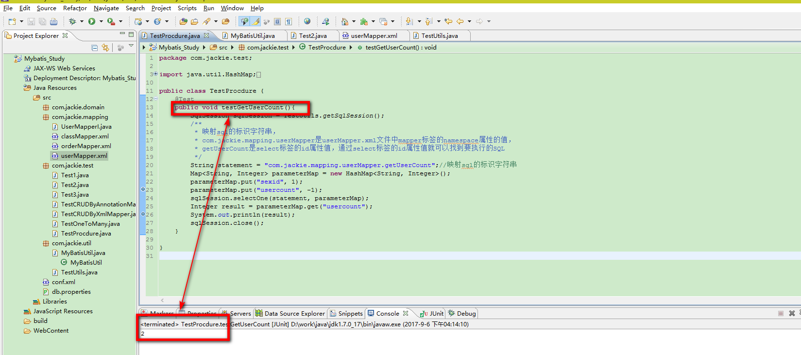

### 一：提出需求
&nbsp;&nbsp;&nbsp;&nbsp;&nbsp;&nbsp;&nbsp;&nbsp;查询得到男性或女性的数量，如果传入的是0就是女性否则是男性。
### 二：准备数据库表和存储过程
```
create table p_user(  
    id int primary key auto_increment,  
    name varchar(10),
    sex char(2)
);

insert into p_user(name,sex) values('A',"男");  
insert into p_user(name,sex) values('B',"女");  
insert into p_user(name,sex) values('C',"男");  

-- 创建存储过程(查询得到男性或女性的数量, 如果传入的是0就女性否则是男性)
DELIMITER $
CREATE PROCEDURE mybatis.ges_user_count(IN sex_id INT, OUT user_count INT)
BEGIN  
IF sex_id=0 THEN
SELECT COUNT(*) FROM mybatis.p_user WHERE p_user.sex='女' INTO user_count;
ELSE
SELECT COUNT(*) FROM mybatis.p_user WHERE p_user.sex='男' INTO user_count;
END IF;
END
$

-- 调用存储过程
DELIMITER ;
SET @user_count = 0;
CALL mybatis.ges_user_count(1, @user_count);
SELECT @user_count;
```

### 三：编辑userMapper.xml文件

```
<!--
        查询得到男性或女性的数量, 如果传入的是0就女性否则是男性
     -->
    <select id="getUserCount" parameterMap="getUserCountMap" statementType="CALLABLE">
        CALL mybatis.ges_user_count(?,?)
    </select>

    <!--
        parameterMap.put("sexid", 0);
        parameterMap.put("usercount", -1);
     -->
    <parameterMap type="java.util.Map" id="getUserCountMap">
        <parameter property="sexid" mode="IN" jdbcType="INTEGER"/>
        <parameter property="usercount" mode="OUT" jdbcType="INTEGER"/>
    </parameterMap>
```

#### 四：编写单元测试代码

```
package com.jackie.test;

import java.util.HashMap;
import java.util.Map;

import org.apache.ibatis.session.SqlSession;
import org.junit.Test;

import com.jackie.util.TestUtils;

public class TestProcdure {
	@Test
	public void testGetUserCount(){
		SqlSession sqlSession = TestUtils.getSqlSession();
		/**
         * 映射sql的标识字符串，
         * com.jackie.mapping.userMapper是userMapper.xml文件中mapper标签的namespace属性的值，
         * getUserCount是select标签的id属性值，通过select标签的id属性值就可以找到要执行的SQL
         */
        String statement = "com.jackie.mapping.userMapper.getUserCount";//映射sql的标识字符串
        Map<String, Integer> parameterMap = new HashMap<String, Integer>();
        parameterMap.put("sexid", 1);
        parameterMap.put("usercount", -1);
        sqlSession.selectOne(statement, parameterMap);
        Integer result = parameterMap.get("usercount");
        System.out.println(result);
        sqlSession.close();
	}
}
```

> 运行结果如下：


