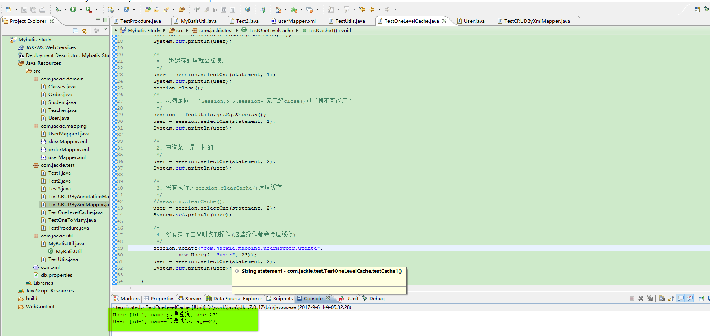
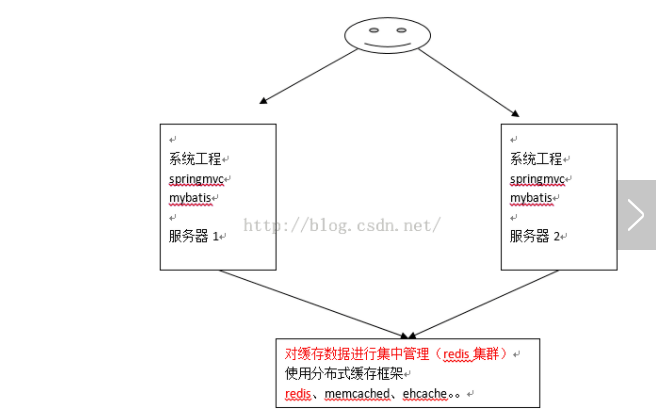

<p align="center"><font size="6">MyBatis缓存介绍</font></p>

&nbsp;&nbsp;&nbsp;&nbsp;&nbsp;&nbsp;&nbsp;&nbsp;正如大多数持久层框架一样，MyBatis同样提供了<font color="red">一级缓存</font>和<font color="red">二级缓存</font>的支持。

* 1、**一级缓存：**</font>基于PerpetualCache的HashMap本地缓存，其**<font color="yellow">存储作用域为Session</font>,**,当**<font color="yellow">Session flush或close</font>**之后，该**<font color="yellow">Session中的所有Cache就将清空</font>**。
* 2、**二级缓存:**二级缓存与一级缓存的机制相同，默认也是采用PerpetualCache，HashMap存储，不同在于其**<font color="yellow">存储作用域为Mapper（Namespace），并且可自定义存储源</font>**，如Ehcache。
* 3、对于缓存数据更新机制，当某一个作用域（一级缓存Session/二级缓存Namespaces）的进行了C/U/D操作后，默认作用域下所有select中的缓存将被clear。

<p align="center"><font color="red" size="6">查询缓存</font></p>

#### 1、什么是查询缓存
> &nbsp;&nbsp;&nbsp;&nbsp;&nbsp;&nbsp;&nbsp;&nbsp;mybatis提供查询缓存，用于减轻数据压力，提高数据库性能。

> &nbsp;&nbsp;&nbsp;&nbsp;&nbsp;&nbsp;&nbsp;&nbsp;mybatis提供一级缓存和二级缓存。

> 

* A：一级缓存

&nbsp;&nbsp;&nbsp;&nbsp;&nbsp;&nbsp;&nbsp;&nbsp;一级缓存是SqlSession级别的缓存。在操作数据库时需要构造sqlSesion对象，在对象中有一个（内存区域）数据结构（HashMap）用于存储缓存数据。不同的sqlSession之间的缓存数据区域（HashMap）是互相不影响的。

&nbsp;&nbsp;&nbsp;&nbsp;&nbsp;&nbsp;&nbsp;&nbsp;一级缓存的作用域是同一个SqlSession，在同一个sqlSession中两次执行相同的sql语句，第一次执行完毕会将数据库中查询的数据写到缓存（内存），第二次会从缓存中获取数据将不再从数据库查询，从而提高查询效率。当一个sqlSession结束后该sqlSession中的一级缓存也就不存在了。MyBatis默认开启一级缓存。

* B： 二级缓存

&nbsp;&nbsp;&nbsp;&nbsp;&nbsp;&nbsp;&nbsp;&nbsp;二级缓存是多个SqlSession共享的，其作用域是mapper的同一个namespace，不同desqlSession两次执行相同的namespace下的sql语句且向sql中传递参数也相同即最终执行相同的sql语句，第一次执行完毕会将数据库中查询的数据写到缓存（内存），第二次会从缓存中获取数据将不再从数据库查询，从而提高查询效率。MyBatis默认没有开启二级缓存，需要在setting全局参数中配置开启二级缓存。

----
<p align="center"><font color="red" size="6">一级缓存</font></p>

##### 1、一级缓存工作原理

&nbsp;&nbsp;&nbsp;&nbsp;&nbsp;&nbsp;&nbsp;&nbsp;下面是根据id查询用户的一级缓存图解：


&nbsp;&nbsp;&nbsp;&nbsp;&nbsp;&nbsp;&nbsp;&nbsp;第一次发起查询用户id为1的用户信息，先去找缓存中是否有id为1的用户信息，如果没有，从数据库查询用户信息。得到用户信息，将用户信息缓存到一级缓存中。如果sqlSession去执行commit操作（执行插入、更新、删除），清空SqlSession中的一级缓存，这样做目的为了让缓存中存储的是最新的信息，避免**<font color="yellow"><i>脏读<i></font>**。

##### 2、一级缓存测试：

```
package com.jackie.test;

import org.apache.ibatis.session.SqlSession;
import org.junit.Test;

import com.jackie.domain.User;
import com.jackie.util.TestUtils;

public class TestOneLevelCache {
	/*
     * 一级缓存: 也就Session级的缓存(默认开启)
     */
    @Test
    public void testCache1() {
        SqlSession session = TestUtils.getSqlSession();
        String statement = "com.jackie.mapping.userMapper.findById";
        User user = session.selectOne(statement, 1);
        System.out.println(user);

        /*
         * 一级缓存默认就会被使用
         */
        user = session.selectOne(statement, 1);
        System.out.println(user);
        session.close();
        /*
         1. 必须是同一个Session,如果session对象已经close()过了就不可能用了
         */
        session = TestUtils.getSqlSession();
        user = session.selectOne(statement, 1);
        System.out.println(user);

        /*
         2. 查询条件是一样的
         */
        user = session.selectOne(statement, 2);
        System.out.println(user);

        /*
         3. 没有执行过session.clearCache()清理缓存
         */
        //session.clearCache();
        user = session.selectOne(statement, 2);
        System.out.println(user);

        /*
         4. 没有执行过增删改的操作(这些操作都会清理缓存)
         */
        session.update("com.jackie.mapping.userMapper.update",
                new User(2, "user", 23));
        user = session.selectOne(statement, 2);
        System.out.println(user);
    }
}
```

> 

##### 3、一级缓存的应用

&nbsp;&nbsp;&nbsp;&nbsp;&nbsp;&nbsp;&nbsp;&nbsp;正式开发，是将mybatis和spring进行整合开发，事务控制再service中。一个service方法中包括很多mapper方法调用。

```
service{
	//开始执行时，开启事务，创建SqlSession对象

	//第一次调用mapper的方法findUserById(1)

	//第二次调用mapper的方法findUserById(1)，从一级缓存中取数据

	//aop控制，只要方法结束，sqlSession关闭，sqlsession关闭后就销毁数据结构，清空缓存
		Service结束，sqlsession关闭
}
```
&nbsp;&nbsp;&nbsp;&nbsp;&nbsp;&nbsp;&nbsp;&nbsp;如果是执行两次service调用查询相同的用户信息，不走一级缓存，因为service方法结束，sqlSession就关闭，一级缓存就清空。

---

***
<p align="center"><font color="red" size="6">二级缓存</font></p>

##### 1、二级缓存原理


&nbsp;&nbsp;&nbsp;&nbsp;&nbsp;&nbsp;&nbsp;&nbsp;首先开启mybatis的二级缓存。

&nbsp;&nbsp;&nbsp;&nbsp;&nbsp;&nbsp;&nbsp;&nbsp;sqlSession1去查询用户id为1的用户信息，查询到用户信息会将查询数据存储到二级缓存中。

&nbsp;&nbsp;&nbsp;&nbsp;&nbsp;&nbsp;&nbsp;&nbsp;如果SqlSession3去执行相同mapper下sql，执行commit提交，清空该mapper下的二级缓存区域的数据。

&nbsp;&nbsp;&nbsp;&nbsp;&nbsp;&nbsp;&nbsp;&nbsp;sqlSession2去查询用户id为1的用户信息，去缓存中找是否存在数据，如果存在直接从缓存中取出数据。

&nbsp;&nbsp;&nbsp;&nbsp;&nbsp;&nbsp;&nbsp;&nbsp;**<font color="red">二级缓存与一级缓存的区别：</font>**二级缓存的范围更大，多个sqlSession可以共享一个UserMapper的二级缓存区域、数据类型仍为HashMap。UserMapper有一个二级缓存区域（按namespace分，如果namespace相同则使用同一个相同的二级缓存区），其他mapper也有自己的二级缓存区域（按namespace分）。每一个namespace的mapper都有一个二级缓存区域，两个mapper的namespace如果相同，这两个mapper执行sql查询到数据将存储再相同的二级缓存区域中。

##### 2、开启二级缓存
&nbsp;&nbsp;&nbsp;&nbsp;&nbsp;&nbsp;&nbsp;&nbsp;mybatis的二级缓存是mapper范围级别的，除了再SqlMapConfig.xml文件中设置二级缓存的总开关，还要在具体的mapper.xml文件中开启二级缓存。

&nbsp;&nbsp;&nbsp;&nbsp;&nbsp;&nbsp;&nbsp;&nbsp;在核心配置文件SqlMapConfig.xml文件中加入：
```
<settingName = 'cacheEnabled' Value='true' />
<!--全局配置参数，需要时在设置-->
<settings>
	<!--开启二级缓存默认值为true-->
	<settingName='cacheEnabled' value='true' />
</settings>
```

|描述|允许值|默认值|
|--|--|--|--|
|cacheEnabled对在此配置文件下的所有cache进行全局性开/关设置|true/false|true|

&nbsp;&nbsp;&nbsp;&nbsp;&nbsp;&nbsp;&nbsp;&nbsp;在UserMapper.xml中开启二级缓存，UserMapper.xml下的sql执行完成会存储到它的缓存区域（HashMap）。

```
<mappernamespace='cn.hpu.mybatis.mapper.UserMapper'>
<!--开启本mappernamespace下的二级缓存-->
<cache></cache>
```

##### 3、调用pojo类实现序列化接口

```
public class User implements Serializable{
	//Serializable实现序列化，为了将来反序列化

}
```

&nbsp;&nbsp;&nbsp;&nbsp;&nbsp;&nbsp;&nbsp;&nbsp;二级缓存需要查询结果映射的pojo对象实现java.io.Serializable接口实现序列化和反序列化操作，注意如果存在父类、成员pojo都需要实现序列化接口。

&nbsp;&nbsp;&nbsp;&nbsp;&nbsp;&nbsp;&nbsp;&nbsp;pojo类实现序列化接口是为了将缓存数据取出执行反序列化操作，因为二级缓存数据存储介质多种多样，不一定在内存有可能是硬盘或者远程服务器。

#### 4、测试方法

```
package com.jackie.test;

import org.apache.ibatis.session.SqlSession;
import org.apache.ibatis.session.SqlSessionFactory;
import org.junit.Test;

import com.jackie.domain.User;
import com.jackie.mapping.UserMapperI;
import com.jackie.util.MyBatisUtil;

public class TestTwoLevelCache {

	 // 测试二级缓存
	 //使用两个不同的SqlSession对象去执行相同查询条件的查询，第二次查询时不会再发送SQL语句，而是直接从缓存中取出数据

	@Test
	public void testCache2(){

		String statement = "com.jackie.mapping.userMapper.findById";
		SqlSessionFactory factory = MyBatisUtil.getSqlSessionFactory();
		//开启两个不同的SqlSession
		SqlSession session1 = factory.openSession();
		SqlSession session2 = factory.openSession();

		//使用二级缓存时，User类必需实现一个Serializable接口==> User implements Serializable
		User user = session1.selectOne(statement, 1);
		session1.commit();
		System.out.println("user="+user);

		//由于使用的是两个不同的SqlSession对象，所以即使查询条件相同，一级缓存也不会开启使用
		user = session2.selectOne(statement, 1);
		System.out.println("user2="+user);
	}
	@Test
	public void testCache2A(){
		SqlSessionFactory factory = MyBatisUtil.getSqlSessionFactory();
		SqlSession sqlSession1 = factory.openSession();
		SqlSession sqlSession2 = factory.openSession();
		SqlSession sqlSession3 = factory.openSession();
		//创建代理对象
		UserMapperI userMapperI = sqlSession1.getMapper(UserMapperI.class);
		//第一次发起请求，查询id为1的用户
		User user1 = userMapperI.getById(1);
		System.out.println(user1);


		//这里执行关闭操作，将sqlsession中的数据写到二级缓存区域
		sqlSession1.close();

		//使用sqlSession3执行commit()操作
		UserMapperI userMapperI3 = sqlSession3.getMapper(UserMapperI.class);
		User user = userMapperI3.getById(1);
		user.setName("张明明");
		user.setAge(23);
		userMapperI3.update(user);
		//执行提交，清空UserMapper下边的二级缓存
		sqlSession3.commit();
		sqlSession3.close();
	}

}

```

> 测试结果如下：

> 

#### 5、userCache配置禁用二级缓存
&nbsp;&nbsp;&nbsp;&nbsp;&nbsp;&nbsp;&nbsp;&nbsp;在statement中设置userCache=false可以禁用当前select语句的二级缓存，即每次查询都会发出sql去查询，默认情况是true，即该sql使用二级缓存。

```
<selectId='findOrderListResultMap' resultMap='ordersUserMap' userCache='false'>
```

&nbsp;&nbsp;&nbsp;&nbsp;&nbsp;&nbsp;&nbsp;&nbsp;总结：针对每次查询都需要最新的数据sql，要设置成userCache=false，禁用二级缓存。

#### 6、mybatis刷新缓存（就是清空缓存）

&nbsp;&nbsp;&nbsp;&nbsp;&nbsp;&nbsp;&nbsp;&nbsp;在mapper的同一个namespace最后哦给你，如果有其他insert、update、dalete操作数据后需要刷新缓存，如果不执行刷新缓存会出现脏读。


&nbsp;&nbsp;&nbsp;&nbsp;&nbsp;&nbsp;&nbsp;&nbsp;设置statement配置中的flushCache='true'属性，默认情况下为true即刷新缓存，如果改成false则不会刷新，使用缓存时如果手动修改数据库表中的查询数据会出现脏读。如下：

```
<insertId='insertUser' parameterType='cn.itcast.mybatis.po.User' flushCache='true'>
```


&nbsp;&nbsp;&nbsp;&nbsp;&nbsp;&nbsp;&nbsp;&nbsp;总结：一般下执行完commit操作都需要刷新缓存，flushCache=true表示刷新缓存默认情况下为true，我们不用去设置它，这样可以避免数据库脏读。

#### 7、Mybatis Cache参数


&nbsp;&nbsp;&nbsp;&nbsp;&nbsp;&nbsp;&nbsp;&nbsp;flushInterval（刷新间隔）可以被设置为任意的正整数，而且它们代表一个合理的毫秒形式的时间段。默认情况是不设置，也就是没有刷新间隔，缓存仅仅调用语句时刷新。


&nbsp;&nbsp;&nbsp;&nbsp;&nbsp;&nbsp;&nbsp;&nbsp;size（引用数目）可以被设置为任意正整数，要记住你缓存的对象数目和你运行环境的可用内存资源数目。默认值是1024.


&nbsp;&nbsp;&nbsp;&nbsp;&nbsp;&nbsp;&nbsp;&nbsp;readOnly（只读）属性可以被设置为true或false。只读的缓存会给所有调用这返回缓存对象的相同实例。因此这些对象不能被修改。这提供了很重要的性能优势。可读写的缓存会饭户籍缓存对象的拷贝（通过序列化）。这会慢一些，但是安全，因此默认是false。如下例子：

```
<cache evition='FIFO' flushInterval='60000' size='512' readOnly='true' />
```


&nbsp;&nbsp;&nbsp;&nbsp;&nbsp;&nbsp;&nbsp;&nbsp;这个更高级的配置创建了一个FIFO缓存，并每隔60秒刷新，存储结果对象或列表的512个引用，而且返回的对象被认为是只读的，因此在不同的线程中的调用者之间修改它们会导致冲突，可用的收回策略有，默认的是LRU。

- LRU——最近最少使用的：移除最长时间不被使用的对象。
- FIFO——先进先出：按对象进入缓存的顺序来移除它们。
- SOFT——软引用：移除基于垃圾回收器状态和软引用规则的对象。
- WEAK——弱引用：更积极地移除基于垃圾收集器状态和弱引用规则的对象。

#### 8、二级缓存应用场景


&nbsp;&nbsp;&nbsp;&nbsp;&nbsp;&nbsp;&nbsp;&nbsp;对于访问多的查询请求且用户对查询结果实时性要求不高，此时可采用mybatis二级缓存技术降低数据库访问量，提高访问速度，业务场景比如：耗时较高的统计分析sql、电话账单查询sql等。


&nbsp;&nbsp;&nbsp;&nbsp;&nbsp;&nbsp;&nbsp;&nbsp;实现方法如下：通过设置刷新间隔时间，由mybatis每隔一段时间自动清空缓存，根据数据变化频率设置缓存刷新间隔flushInterval，比如设置为30分钟、60分钟、24小时等，根据需求而定。

#### 9、二级缓存的局限性

&nbsp;&nbsp;&nbsp;&nbsp;&nbsp;&nbsp;&nbsp;&nbsp;mybatis二级缓存对细粒度的数据级别的缓存实现不好，对同时缓存较多条数据的缓存，比如如下需求：对商品信息进行缓存，由于商品信息查询访问量大，但是要求用户每次都能查询最新的商品信息，此时如果使用mybatis的二级缓存就无法实现当一个商品变化时值刷新该商品的缓存信息而不刷新其他商品的信息，因为mybatis的二级缓存区域以mapper为单位划分，当一个商品信息变化会讲所有商品信息的缓存数据全部清空。解决此类问题需要在业务层根据需求对数据有针对性缓存。需要使用三级缓存。

***

***
### mybatis整合ehcache

&nbsp;&nbsp;&nbsp;&nbsp;&nbsp;&nbsp;&nbsp;&nbsp;ehcache是一个分布式缓存框架。

&nbsp;&nbsp;&nbsp;&nbsp;&nbsp;&nbsp;&nbsp;&nbsp;EhCache是一个纯Java的进程内缓存框架，是一种广泛使用的开源Java分布式缓存，具有快速、精干等特点，是Hibernate中默认的CacheProvider。

<p align="center"><font color="red" size="6">分布缓存ehcache</font></p>

&nbsp;&nbsp;&nbsp;&nbsp;&nbsp;&nbsp;&nbsp;&nbsp;系统为了提高系统并发，性能，一般对系统进行分布式部署（集群部署方式）



&nbsp;&nbsp;&nbsp;&nbsp;&nbsp;&nbsp;&nbsp;&nbsp;不使用分布缓存，缓存的数据在各个服务单独存储，不方便系统开发。所以要使用分布式缓存对缓存数据进行集中管理。

&nbsp;&nbsp;&nbsp;&nbsp;&nbsp;&nbsp;&nbsp;&nbsp;mybatis无法实现分布式缓存，需要和其他分布式缓存框架进行整合。

#### 1、整合方法（掌握无论整合谁，首先想到改type接口）

&nbsp;&nbsp;&nbsp;&nbsp;&nbsp;&nbsp;&nbsp;&nbsp;mybatis提供了一个cache接口，如果要实现自己的缓存逻辑，实现cache接口开发即可。
&nbsp;&nbsp;&nbsp;&nbsp;&nbsp;&nbsp;&nbsp;&nbsp;mybatis和ehcache整合，mybatis和ehcache整合包中提供了一个擦车接口的实现类。

- 第一步：加入ehcache包

- 

- 第二步：整合ehcache
&nbsp;&nbsp;&nbsp;&nbsp;&nbsp;&nbsp;&nbsp;&nbsp;配置mapper中cache中的type为ehcache对cache接口的实现类型。

```
<mappernamespace='cn.hpu.mybatis.mapper.UserMapper'>
<!--开启本mappernamespace下的二级缓存
	type:指定cache接口实现类，mybatis默认使用PerpetualCache
	要和ehcache整合，需要配置type为ehcache实现cache接口的类型
-->
<cachetype='org.mybatis.caches.ehcache.EhcacehCache'>
</cache>
```

&nbsp;&nbsp;&nbsp;&nbsp;&nbsp;&nbsp;&nbsp;&nbsp;可以根据需求调整缓存参数：

```
<cachetype='org.mybatis.caches.ehcache.EhcacehCache'>
	<propertyname='timeToldleSeconds' Value='3600' />
	<propertyname='timeToLiveSeconds' Value='3600' />
	<!--同ehcache参数maxElementsInMemory-->
	<propertyname='maxEntriesLocalHeap' value='1000' />
	<!--同ehcache参数maxElementsOnDisk-->
	<propertyname='maxEntriesLocalDisk' value='10000000' />
	<propertyname='memoryStoreEvictionPolicy' value='LRU' />
</cache>
	```

- 第三步：加入ehcache的配置文件

- 在classpath下配置ehcache.xml

```
<ehcache xmlns:xsi='http://www.w3.org/2001/XMLSchema-instance'
							xsi:noNamespaceSchemaLocation='../config/ehcache.xsd'>
				<diskStorepath='F:\develop\ehcache' />
			<defaultCache
				 maxElementsInMemory='1000'
				 maxElementsOnDisk='10000000'
				 eternal='false'
				 overflowToDist='false'
				 timeToldleSeconds='120'
				 timeToLiveSeconds='120'
				 diskExpiryThreadIntervalSeconds='120'
				 memoryStoreEvictionPolicy='LRU'>
			</defaultCache>
</ehcache>
```
&nbsp;&nbsp;&nbsp;&nbsp;&nbsp;&nbsp;&nbsp;&nbsp;<font color="red" size='3'>属性说明：</font>

- <font color="yellow">diskStore:</font>指定数据在磁场中的存储位置。
- <font color="yellow">defaultCache:</font>当借助CacheManager.add('demoCache')创建Cache时，EhCache便会采用<defaultCache/>指定的管理策略。
- <font color="yellow">maxElementsInMemory:</font>在内存中缓存的element的最大数目。
- <font color="yellow">maxElementsOnDisk:</font>在磁盘上缓存的element的最大数目，若是0表示无穷大。
- <font color="yellow">eternal:</font>设定缓存的elements是否永远不过期。如果为true，则缓存的数据始终有效，如果为false那么还要根据timeToldleSeconds,timeToLiveSeconds判断。
- <font color="yellow">overflowToDist:</font>设定当内存缓存溢出的时候是否将过期的element缓存到磁盘上

> 以下属性是可选的：

- <font color="yellow">timeToldleSeconds:</font>当缓存在EhCache中的数据前后两次访问的时间超过timeToldleSeconds的属性取值时，这些数据便会删除，默认值时0，也就是可闲置时间无穷大。
- <font color="yellow">timeToLiveSeconds:</font> 缓存element的有效生命期，默认时0，也就是element存活时间无穷大。
- <font color="yellow">diskSpoolBufferSizeMB:</font>这个参数设置DiskStore（磁盘缓存）的缓存区大小。默认是30MB，没个Cache都应该有自己的一个缓冲区。
- <font color="yellow">diskPersistent:</font>在VM重启的时候是否用磁盘保护Ehcache中的数据，默认时false。
- <font color="yellow">diskExpiryThreadIntervalSeconds:</font>磁盘缓存的清理线程运行间隔，默认时120秒。每个120s，相应的线程会进行一次EhCache中数据的清理工作。
- <font color="yellow">memoryStoreEvictionPolicy:</font>当内存缓存达到最大，有新的element加入的时候，移除缓存中element的策略。默认时LRU（最近最少使用），可选的有LFU（最不常使用）和FIFO（先进先出）。

***
