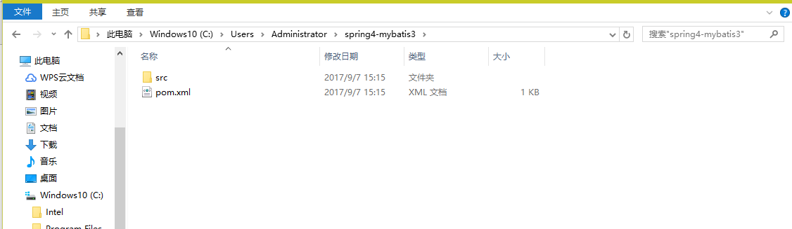
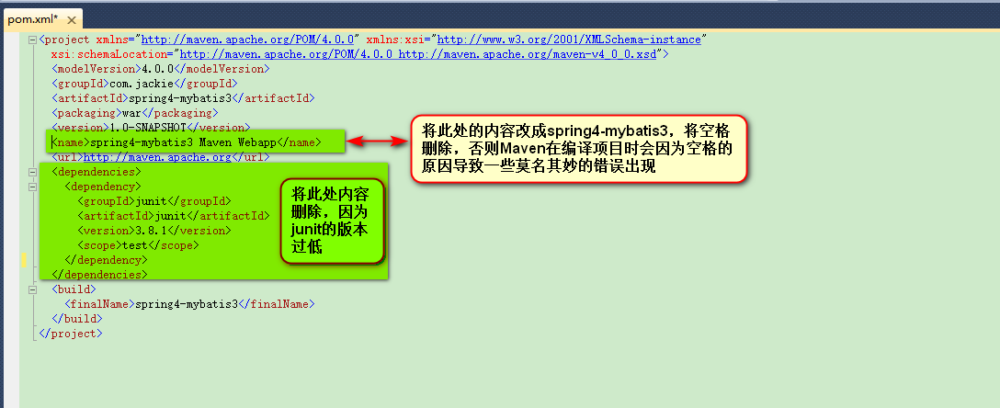
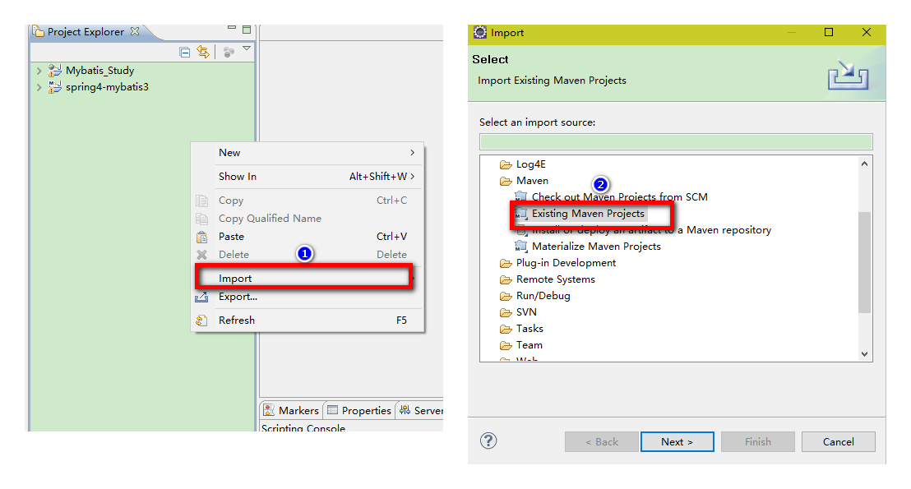
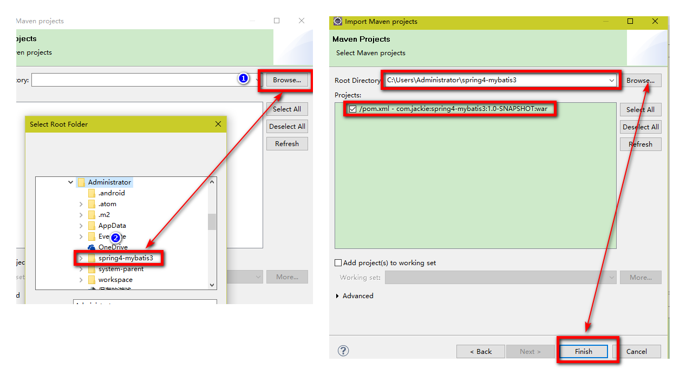
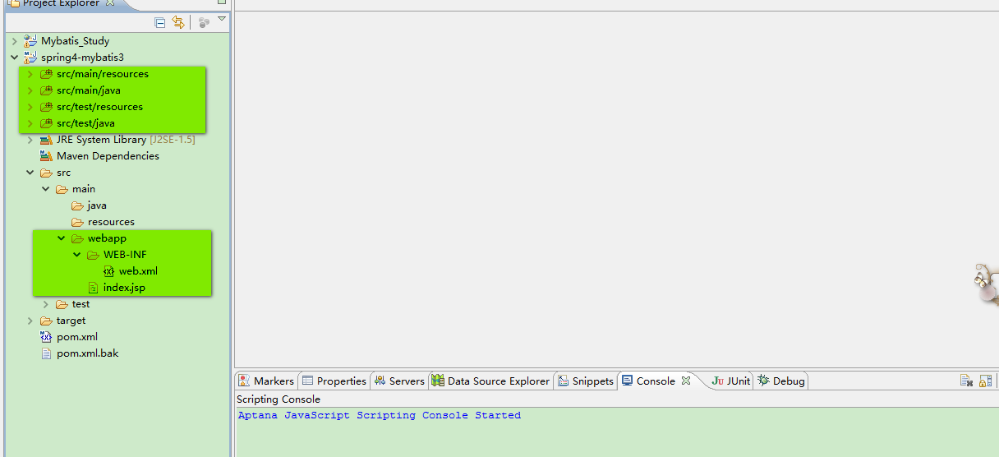
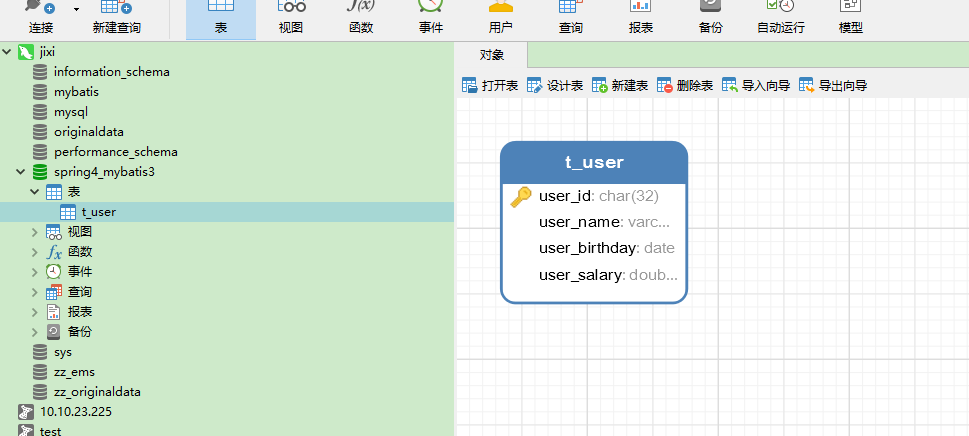

<p align="center"><font color="red" size="5">MyBatis3.x与Spring4.x整合</font></p>

### 一：搭建开发环境
#### 1、使用Maven创建Web项目
> 执行以下命令

```
mvn archetype:create -DgroupId=com.jackie
                     -DartifactId=spring4-mybatis3
                     -DarchetypeArtifactId=maven-archetype-webapp
                     -DinteractiveMode=false
```

> 如下图所示：

> 

> 创建好的目录如下：

> 

> 编辑pom.xml文件

> 

> 改后的pom文件如下：

```
<project xmlns="http://maven.apache.org/POM/4.0.0" xmlns:xsi="http://www.w3.org/2001/XMLSchema-instance"
  xsi:schemaLocation="http://maven.apache.org/POM/4.0.0 http://maven.apache.org/maven-v4_0_0.xsd">
  <modelVersion>4.0.0</modelVersion>
  <groupId>com.jackie</groupId>
  <artifactId>spring4-mybatis3</artifactId>
  <packaging>war</packaging>
  <version>1.0-SNAPSHOT</version>
  <name>spring4-mybatis3</name>
  <url>http://maven.apache.org</url>
  <dependencies>

  </dependencies>
  <build>
    <finalName>spring4-mybatis3</finalName>
  </build>
</project>
```

#### 2、将创建好的项目导入到Eclipse中

> 具体操作步骤如下图所示：

> 

> 

> 手动创建【src/main/java】、【src/test/resources】、【src/test/java】这三个source folder，如下图所示：

> 

> 至此，项目搭建的工作全部完成。

### 二：创建数据库和表（针对MySql）

> SQL脚本如下：

```
```

> 创建好的数据库和表如下：

> 
