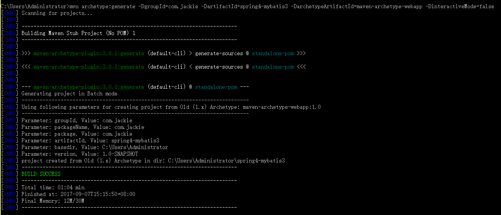
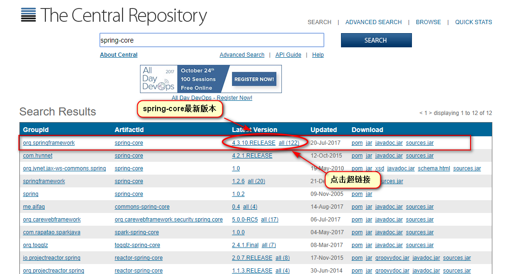

<p align="center"><font color="red" size="5">MyBatis3.x与Spring4.x整合</font></p>

### 一：搭建开发环境
#### 1、使用Maven创建Web项目
> 执行以下命令

```
mvn archetype:create -DgroupId=com.jackie
                     -DartifactId=spring4-mybatis3
                     -DarchetypeArtifactId=maven-archetype-webapp
                     -DinteractiveMode=false
```

> 如下图所示：

> 

> 创建好的目录如下：

> 

> 编辑pom.xml文件

> 

> 改后的pom文件如下：

```
<project xmlns="http://maven.apache.org/POM/4.0.0" xmlns:xsi="http://www.w3.org/2001/XMLSchema-instance"
  xsi:schemaLocation="http://maven.apache.org/POM/4.0.0 http://maven.apache.org/maven-v4_0_0.xsd">
  <modelVersion>4.0.0</modelVersion>
  <groupId>com.jackie</groupId>
  <artifactId>spring4-mybatis3</artifactId>
  <packaging>war</packaging>
  <version>1.0-SNAPSHOT</version>
  <name>spring4-mybatis3</name>
  <url>http://maven.apache.org</url>
  <dependencies>

  </dependencies>
  <build>
    <finalName>spring4-mybatis3</finalName>
  </build>
</project>
```

#### 2、将创建好的项目导入到Eclipse中

> 具体操作步骤如下图所示：

> 

> 

> 手动创建【src/main/java】、【src/test/resources】、【src/test/java】这三个source folder，如下图所示：

> 

> 至此，项目搭建的工作全部完成。

### 二：创建数据库和表（针对MySql）

> SQL脚本如下：

```
Create DATABASE spring4_mybatis3;
USE spring4_mybatis3;

DROP TABLE IF EXISTS t_user;
CREATE TABLE t_user (
  user_id char(32) NOT NULL,
  user_name varchar(30) DEFAULT NULL,
  user_birthday date DEFAULT NULL,
  user_salary double DEFAULT NULL,
  PRIMARY KEY (user_id)
) ENGINE=InnoDB DEFAULT CHARSET=utf8;
```

> 创建好的数据库和表如下：

> 

### 三：使用generator工具生成代码

&nbsp;&nbsp;&nbsp;&nbsp;&nbsp;&nbsp;&nbsp;&nbsp;在网上找到了一个generator工具可以根据创建好的数据库表生成MyBatis的表对应的实体类，SQL映射文件和dao，找到generator工具根目录并在改目录下创建generatorConfig.xml文件，这个文件是用来配置代码生成规则的，如下图所示：


&nbsp;&nbsp;&nbsp;&nbsp;&nbsp;&nbsp;&nbsp;&nbsp;编写generatorConfig.xml文件，内容如下：

```
<?xml version="1.0" encoding="UTF-8"?>
<!DOCTYPE generatorConfiguration PUBLIC "-//mybatis.org//DTD MyBatis Generator Configuration 1.0//EN" "http://mybatis.org/dtd/mybatis-generator-config_1_0.dtd">
<generatorConfiguration>
    <!-- 数据库驱动包位置 -->
     <classPathEntry location="mysql-connector-java-5.1.7-bin.jar" />  
    <!-- <classPathEntry location="C:\oracle\product\10.2.0\db_1\jdbc\lib\ojdbc14.jar" />-->
    <context id="DB2Tables" targetRuntime="MyBatis3">
        <commentGenerator>
            <property name="suppressAllComments" value="true" />
        </commentGenerator>
        <!-- 数据库链接URL、用户名、密码 -->
         <jdbcConnection driverClass="com.mysql.jdbc.Driver" connectionURL="jdbc:mysql://localhost:3306/spring4_mybatis3" userId="root" password="mysql">
        <!--<jdbcConnection driverClass="oracle.jdbc.driver.OracleDriver" connectionURL="jdbc:oracle:thin:@localhost:1521:orcl" userId="msa" password="msa">-->
        </jdbcConnection>
        <javaTypeResolver>
            <property name="forceBigDecimals" value="false" />
        </javaTypeResolver>
        <!-- 生成实体类的包名和位置，这里配置将生成的实体类放在com.jackie.domain这个包下 -->
        <javaModelGenerator targetPackage="com.jackie.domain" targetProject="C:\Users\Administrator\spring4-mybatis3\src\main\java">
            <property name="enableSubPackages" value="true" />
            <property name="trimStrings" value="true" />
        </javaModelGenerator>
        <!-- 生成的SQL映射文件包名和位置，这里配置将生成的SQL映射文件放在com.jackie.mapping这个包下 -->
        <sqlMapGenerator targetPackage="com.jackie.mapping" targetProject="C:\Users\Administrator\spring4-mybatis3\src\main\java">
            <property name="enableSubPackages" value="true" />
        </sqlMapGenerator>
        <!-- 生成DAO的包名和位置，这里配置将生成的dao类放在com.jackie.dao这个包下 -->
        <javaClientGenerator type="XMLMAPPER" targetPackage="com.jackie.dao" targetProject="C:\Users\Administrator\spring4-mybatis3\src\main\java">
            <property name="enableSubPackages" value="true" />
        </javaClientGenerator>
        <!-- 要生成那些表(更改tableName和domainObjectName就可以) -->
        <table tableName="t_user" domainObjectName="User" enableCountByExample="false" enableUpdateByExample="false" enableDeleteByExample="false" enableSelectByExample="false" selectByExampleQueryId="false" />
    </context>
</generatorConfiguration>
```

&nbsp;&nbsp;&nbsp;&nbsp;&nbsp;&nbsp;&nbsp;&nbsp;代开命令行窗口，切换到生成工具的根目录，执行如下命令：

```
java -jar mybatis-generator-core-1.3.5.jar -configfile generatorConfig.xml -overwrite
```

&nbsp;&nbsp;&nbsp;&nbsp;&nbsp;&nbsp;&nbsp;&nbsp;如下图所示：


&nbsp;&nbsp;&nbsp;&nbsp;&nbsp;&nbsp;&nbsp;&nbsp;刚才我们在generatorConfig.xml文件中配置将生成的代码和SQL映射文件放到"C:\Users\Administrator\spring4-mybatis3\src\main\java"这个目录下，这个目录就是我们的spring4-mybatis3项目所在目录，我们刷新一下src/main/java目录，就可以看到生成的代码和映射文件了，如下图所示：


&nbsp;&nbsp;&nbsp;&nbsp;&nbsp;&nbsp;&nbsp;&nbsp;生成的代码和映射文件一行都不用改，可以直接应用到项目当中，下面我们看一眼由generator工具生成的代码和映射文件：

- 1、生成的dao类

```
package com.jackie.dao;

import com.jackie.domain.User;

public interface UserMapper {
    int deleteByPrimaryKey(String userId);

    int insert(User record);

    int insertSelective(User record);

    User selectByPrimaryKey(String userId);

    int updateByPrimaryKeySelective(User record);

    int updateByPrimaryKey(User record);
}
```

> &nbsp;&nbsp;&nbsp;&nbsp;&nbsp;&nbsp;&nbsp;&nbsp;<font color="red">生成的UserMapper是一个接口，里面定义了一些操作t_user表的增删改查方法。</font>

- 生成的实体类

```
package com.jackie.domain;

import java.util.Date;

public class User {
    private String userId;

    private String userName;

    private Date userBirthday;

    private Double userSalary;

    public String getUserId() {
        return userId;
    }

    public void setUserId(String userId) {
        this.userId = userId == null ? null : userId.trim();
    }

    public String getUserName() {
        return userName;
    }

    public void setUserName(String userName) {
        this.userName = userName == null ? null : userName.trim();
    }

    public Date getUserBirthday() {
        return userBirthday;
    }

    public void setUserBirthday(Date userBirthday) {
        this.userBirthday = userBirthday;
    }

    public Double getUserSalary() {
        return userSalary;
    }

    public void setUserSalary(Double userSalary) {
        this.userSalary = userSalary;
    }
}
```

- 生成的sql映射文件

```
<?xml version="1.0" encoding="UTF-8"?>
<!DOCTYPE mapper PUBLIC "-//mybatis.org//DTD Mapper 3.0//EN" "http://mybatis.org/dtd/mybatis-3-mapper.dtd">
<mapper namespace="com.jackie.dao.UserMapper">
  <resultMap id="BaseResultMap" type="com.jackie.domain.User">
    <id column="user_id" jdbcType="CHAR" property="userId" />
    <result column="user_name" jdbcType="VARCHAR" property="userName" />
    <result column="user_birthday" jdbcType="DATE" property="userBirthday" />
    <result column="user_salary" jdbcType="DOUBLE" property="userSalary" />
  </resultMap>
  <sql id="Base_Column_List">
    user_id, user_name, user_birthday, user_salary
  </sql>
  <select id="selectByPrimaryKey" parameterType="java.lang.String" resultMap="BaseResultMap">
    select
    <include refid="Base_Column_List" />
    from t_user
    where user_id = #{userId,jdbcType=CHAR}
  </select>
  <delete id="deleteByPrimaryKey" parameterType="java.lang.String">
    delete from t_user
    where user_id = #{userId,jdbcType=CHAR}
  </delete>
  <insert id="insert" parameterType="com.jackie.domain.User">
    insert into t_user (user_id, user_name, user_birthday,
      user_salary)
    values (#{userId,jdbcType=CHAR}, #{userName,jdbcType=VARCHAR}, #{userBirthday,jdbcType=DATE},
      #{userSalary,jdbcType=DOUBLE})
  </insert>
  <insert id="insertSelective" parameterType="com.jackie.domain.User">
    insert into t_user
    <trim prefix="(" suffix=")" suffixOverrides=",">
      <if test="userId != null">
        user_id,
      </if>
      <if test="userName != null">
        user_name,
      </if>
      <if test="userBirthday != null">
        user_birthday,
      </if>
      <if test="userSalary != null">
        user_salary,
      </if>
    </trim>
    <trim prefix="values (" suffix=")" suffixOverrides=",">
      <if test="userId != null">
        #{userId,jdbcType=CHAR},
      </if>
      <if test="userName != null">
        #{userName,jdbcType=VARCHAR},
      </if>
      <if test="userBirthday != null">
        #{userBirthday,jdbcType=DATE},
      </if>
      <if test="userSalary != null">
        #{userSalary,jdbcType=DOUBLE},
      </if>
    </trim>
  </insert>
  <update id="updateByPrimaryKeySelective" parameterType="com.jackie.domain.User">
    update t_user
    <set>
      <if test="userName != null">
        user_name = #{userName,jdbcType=VARCHAR},
      </if>
      <if test="userBirthday != null">
        user_birthday = #{userBirthday,jdbcType=DATE},
      </if>
      <if test="userSalary != null">
        user_salary = #{userSalary,jdbcType=DOUBLE},
      </if>
    </set>
    where user_id = #{userId,jdbcType=CHAR}
  </update>
  <update id="updateByPrimaryKey" parameterType="com.jackie.domain.User">
    update t_user
    set user_name = #{userName,jdbcType=VARCHAR},
      user_birthday = #{userBirthday,jdbcType=DATE},
      user_salary = #{userSalary,jdbcType=DOUBLE}
    where user_id = #{userId,jdbcType=CHAR}
  </update>
</mapper>
```

&nbsp;&nbsp;&nbsp;&nbsp;&nbsp;&nbsp;&nbsp;&nbsp;UserMapper.xml这个文件的内容是编写操作t_user表的SQL语句，重点说一下UserMapper.xml配置中需要注意的几个细节问题：

* 1、UserMapper.xml的<mapper>标签的namespace必须是UserMapper接口的全类名，即**<mapper namespace="com.jackie.dao.UserMapper>"**

* 2、UserMapper.xml的定义操作数据的select/delete/update/insert这些标签的id属性的值必须和UserMapper接口定义的方法名一致，如下图所示：


### 四：Spring与MyBatis整合

&nbsp;&nbsp;&nbsp;&nbsp;&nbsp;&nbsp;&nbsp;&nbsp;首先我们要在项目中加入我们需要的相关jar包，我们可以到Maven的中央仓库：http://search.maven.org/ 找到我们要的相关jar包，如下图所示：


&nbsp;&nbsp;&nbsp;&nbsp;&nbsp;&nbsp;&nbsp;&nbsp;我们只需要在搜索框中输入要找的jar包的名称，点击【SEARCH】按钮，就可以找到我们要的jar包了。

#### 1、添加spring与mybatis的相关jar包
> A:添加spring-core，输入spring-core关键字进行查找，如下图所示：

> 

> &nbsp;&nbsp;&nbsp;&nbsp;&nbsp;&nbsp;&nbsp;&nbsp;找到关于spring-core依赖的相关描述信息，如下图所示：

> 

>  &nbsp;&nbsp;&nbsp;&nbsp;&nbsp;&nbsp;&nbsp;&nbsp;将下面的代码：

```
<dependency>
	    <groupId>org.springframework</groupId>
	    <artifactId>spring-core</artifactId>
	    <version>4.3.10.RELEASE</version>
	</dependency>
```

> 复制到pom.xml文件中，如下所示：

```
<project xmlns="http://maven.apache.org/POM/4.0.0" xmlns:xsi="http://www.w3.org/2001/XMLSchema-instance"
  xsi:schemaLocation="http://maven.apache.org/POM/4.0.0 http://maven.apache.org/maven-v4_0_0.xsd">
  <modelVersion>4.0.0</modelVersion>
  <groupId>com.jackie</groupId>
  <artifactId>spring4-mybatis3</artifactId>
  <packaging>war</packaging>
  <version>1.0-SNAPSHOT</version>
  <name>spring4-mybatis3</name>
  <url>http://maven.apache.org</url>
  <dependencies>
  	<!--添加spring4.3.10的核心包-->
  	<dependency>
	    <groupId>org.springframework</groupId>
	    <artifactId>spring-core</artifactId>
	    <version>4.3.10.RELEASE</version>
	</dependency>
  </dependencies>
  <build>
    <finalName>spring4-mybatis3</finalName>
  </build>
</project>
```

> 　这样Maven就会自动帮我们从Maven的中央仓库中下载spring-core这个jar包到我们的本地仓库，然后将spring-core这个jar包以及它的相关依赖包加入到我们的项目当中，如下所示：

> 

>　spring4.x与mybatis3.x所需要的相关jar包都可以采用上述所说的方式进行查找，然后添加到项目当中，添加完spring4.x与mybatis3.x相关jar包后，pom.xml文件内容最终如下：

```
<project xmlns="http://maven.apache.org/POM/4.0.0" xmlns:xsi="http://www.w3.org/2001/XMLSchema-instance"
  xsi:schemaLocation="http://maven.apache.org/POM/4.0.0 http://maven.apache.org/maven-v4_0_0.xsd">
  <modelVersion>4.0.0</modelVersion>
  <groupId>com.jackie</groupId>
  <artifactId>spring4-mybatis3</artifactId>
  <packaging>war</packaging>
  <version>1.0-SNAPSHOT</version>
  <name>spring4-mybatis3</name>
  <url>http://maven.apache.org</url>
  <dependencies>
  	 <!-- 添加spring-context包 -->
        <dependency>
            <groupId>org.springframework</groupId>
            <artifactId>spring-context</artifactId>
            <version>4.3.10.RELEASE</version>
        </dependency>
        <!-- 添加spring-tx包 -->
        <dependency>
            <groupId>org.springframework</groupId>
            <artifactId>spring-tx</artifactId>
            <version>4.3.10.RELEASE</version>
        </dependency>
        <!-- 添加spring-jdbc包 -->
        <dependency>
            <groupId>org.springframework</groupId>
            <artifactId>spring-jdbc</artifactId>
            <version>4.3.10.RELEASE</version>
        </dependency>
        <!-- 为了方便进行单元测试，添加spring-test包 -->
        <dependency>
            <groupId>org.springframework</groupId>
            <artifactId>spring-test</artifactId>
            <version>4.3.10.RELEASE</version>
        </dependency>
        <!--添加spring-web包 -->
        <dependency>
            <groupId>org.springframework</groupId>
            <artifactId>spring-web</artifactId>
            <version>4.3.10.RELEASE</version>
        </dependency>
        <!--添加aspectjweaver包 -->
        <dependency>
            <groupId>org.aspectj</groupId>
            <artifactId>aspectjweaver</artifactId>
            <version>1.8.5</version>
        </dependency>
        <!-- 添加mybatis的核心包 -->
        <dependency>
            <groupId>org.mybatis</groupId>
            <artifactId>mybatis</artifactId>
            <version>3.2.8</version>
        </dependency>
        <!-- 添加mybatis与Spring整合的核心包 -->
        <dependency>
            <groupId>org.mybatis</groupId>
            <artifactId>mybatis-spring</artifactId>
            <version>1.2.2</version>
        </dependency>
        <!-- 添加servlet3.0核心包 -->
        <dependency>
            <groupId>javax.servlet</groupId>
            <artifactId>javax.servlet-api</artifactId>
            <version>3.0.1</version>
        </dependency>
        <dependency>
            <groupId>javax.servlet.jsp</groupId>
            <artifactId>javax.servlet.jsp-api</artifactId>
            <version>2.3.2-b01</version>
        </dependency>
        <!-- jstl -->
        <dependency>
            <groupId>javax.servlet</groupId>
            <artifactId>jstl</artifactId>
            <version>1.2</version>
        </dependency>
        <!-- 添加mysql驱动包 -->
        <dependency>
            <groupId>mysql</groupId>
            <artifactId>mysql-connector-java</artifactId>
            <version>5.1.34</version>
        </dependency>
        <!-- 添加druid连接池包 -->
        <dependency>
            <groupId>com.alibaba</groupId>
            <artifactId>druid</artifactId>
            <version>1.0.12</version>
        </dependency>
        <!-- 添加junit单元测试包 -->
        <dependency>
            <groupId>junit</groupId>
            <artifactId>junit</artifactId>
            <version>4.12</version>
            <scope>test</scope>
        </dependency>
  </dependencies>
  <build>
    <finalName>spring4-mybatis3</finalName>
  </build>
</project>
```

> 

#### 2、编写相关配置文件

* 1、dbconfig.properties
&nbsp;&nbsp;&nbsp;&nbsp;&nbsp;&nbsp;&nbsp;&nbsp;在src/main/resources目录下创建一个dbconfig.properties文件，用于编写连接MySQL数据库的相关信息，dbconfig.properties的内容如下：

```
driverClassName = com.mysql.jdbc.Driver
validationQuery = SELECT 1
jdbc_url = jdbc:mysql://localhost:3306/spring4_mybatis3?userUnicode = true&characterEncoding = UTF-8&zeroDateTimeBehavior = converToNull
jdbc_username = root
jdbc_password = mysql
```

* 2、spring.xml文件（spring框架的配置文件）

```
<?xml version="1.0" encoding="utf-8"?>
 <beans xmlns="http://www.springframework.org/schema/beans"
    xmlns:xsi="http://www.w3.org/2001/XMLSchema-instance"
	xmlns:context="http://www.springframework.org/schema/context"
    xsi:schemaLocation="
	http://www.springframework.org/schema/beans
	http://www.springframework.org/schema/beans/spring-beans-3.0.xsd
	http://www.springframework.org/schema/context
	http://www.springframework.org/schema/context/spring-context-3.0.xsd">
	<!--引入dbconfig.properties属性文件-->
	<context:property-placeholder location="classpath:dbconfig.properties" />
	<!--自动扫描（自动注入），扫描com.jackie.service这个包以及它的子包的所有使用@Service注解标注的类-->
	<context:component-scan base-package="com.jackie.service" />
</beans>
```

* 3、spring-mybatis.xml（spring与mybatis整合的配置文件）

> 在src/main/resources目录下创建一个spring-mybatis.xml文件，spring-mybatis.xml文件就是针对Spring框架与Mybatis框架整合编写的配置文件，spring-mybatis.xml的内容如下：

```
<?xml version="1.0" encoding="utf-8"?>
 <beans xmlns="http://www.springframework.org/schema/beans" xmlns:xsi="http://www.w3.org/2001/XMLSchema-instance" xmlns:tx="http://www.springframework.org/schema/tx" xmlns:aop="http://www.springframework.org/schema/aop" xsi:schemaLocation="
		http://www.springframework.org/schema/beans
		http://www.springframework.org/schema/beans/spring-beans-3.0.xsd
		http://www.springframework.org/schema/tx
		http://www.springframework.org/schema/tx/spring-tx-3.0.xsd
		http://www.springframework.org/schema/aop
		http://www.springframework.org/schema/aop/spring-aop-3.0.xsd
		">
		<!-- JNDI方式配置数据源 -->
    <!-- <bean id="dataSource" class="org.springframework.jndi.JndiObjectFactoryBean">
	 <property name="jndiName" value="${jndiName}"></property> </bean> -->
    <!-- ========================================配置数据源========================================= -->
    <!-- 配置数据源，使用的是alibaba的Druid(德鲁伊)数据源 -->
    <bean name="dataSource" class="com.alibaba.druid.pool.DruidDataSource" init-method="init" destroy-method="close">
        <property name="url" value="${jdbc_url}" />
        <property name="username" value="${jdbc_username}" />
        <property name="password" value="${jdbc_password}" />
        <!-- 初始化连接大小 -->
        <property name="initialSize" value="0" />
        <!-- 连接池最大使用连接数量 -->
        <property name="maxActive" value="20" />
        <!-- 连接池最大空闲 -->
        <property name="maxIdle" value="20" />
        <!-- 连接池最小空闲 -->
        <property name="minIdle" value="0" />
        <!-- 获取连接最大等待时间 -->
        <property name="maxWait" value="60000" />
        <!--
        <property name="poolPreparedStatements" value="true" />
        <property name="maxPoolPreparedStatementPerConnectionSize" value="33" />
        -->
        <property name="validationQuery" value="${validationQuery}" />
        <property name="testOnBorrow" value="false" />
        <property name="testOnReturn" value="false" />
        <property name="testWhileIdle" value="true" />
        <!-- 配置间隔多久才进行一次检测，检测需要关闭的空闲连接，单位是毫秒 -->
        <property name="timeBetweenEvictionRunsMillis" value="60000" />
        <!-- 配置一个连接在池中最小生存的时间，单位是毫秒 -->
        <property name="minEvictableIdleTimeMillis" value="25200000" />
        <!-- 打开removeAbandoned功能 -->
        <property name="removeAbandoned" value="true" />
        <!-- 1800秒，也就是30分钟 -->
        <property name="removeAbandonedTimeout" value="1800" />
        <!-- 关闭abanded连接时输出错误日志 -->
        <property name="logAbandoned" value="true" />
        <!-- 监控数据库 -->
        <!-- <property name="filters" value="stat" /> -->
        <property name="filters" value="mergeStat" />
    </bean>

    <!-- ========================================分隔线========================================= -->

    <!-- ========================================针对myBatis的配置项============================== -->
    <!-- 配置sqlSessionFactory -->
    <bean id="sqlSessionFactory" class="org.mybatis.spring.SqlSessionFactoryBean">
        <!-- 实例化sqlSessionFactory时需要使用上述配置好的数据源以及SQL映射文件 -->
        <property name="dataSource" ref="dataSource" />
        <!-- 自动扫描com/jackie/mapping/目录下的所有SQL映射的xml文件, 省掉Configuration.xml里的手工配置
        value="classpath:com/jackie/mapping/*.xml"指的是classpath(类路径)下com.jackie.mapping包中的所有xml文件
        UserMapper.xml位于com.jackie.mapping包下，这样UserMapper.xml就可以被自动扫描
         -->
        <property name="mapperLocations" value="classpath:com/jackie/mapping/*.xml" />
    </bean>
    <!-- 配置扫描器 -->
    <bean class="org.mybatis.spring.mapper.MapperScannerConfigurer">
        <!-- 扫描me.jackie.dao这个包以及它的子包下的所有映射接口类 -->
        <property name="basePackage" value="com.jackie.dao" />
        <property name="sqlSessionFactoryBeanName" value="sqlSessionFactory" />
    </bean>

    <!-- ========================================分隔线========================================= -->
    <!-- 配置Spring的事务管理器 -->
    <bean id="transactionManager" class="org.springframework.jdbc.datasource.DataSourceTransactionManager">
        <property name="dataSource" ref="dataSource" />
    </bean>

    <!-- 注解方式配置事物 -->
    <!-- <tx:annotation-driven transaction-manager="transactionManager" /> -->

    <!-- 拦截器方式配置事物 -->
    <tx:advice id="transactionAdvice" transaction-manager="transactionManager">
        <tx:attributes>
            <tx:method name="add*" propagation="REQUIRED" />
            <tx:method name="append*" propagation="REQUIRED" />
            <tx:method name="insert*" propagation="REQUIRED" />
            <tx:method name="save*" propagation="REQUIRED" />
            <tx:method name="update*" propagation="REQUIRED" />
            <tx:method name="modify*" propagation="REQUIRED" />
            <tx:method name="edit*" propagation="REQUIRED" />
            <tx:method name="delete*" propagation="REQUIRED" />
            <tx:method name="remove*" propagation="REQUIRED" />
            <tx:method name="repair" propagation="REQUIRED" />
            <tx:method name="delAndRepair" propagation="REQUIRED" />

            <tx:method name="get*" propagation="SUPPORTS" />
            <tx:method name="find*" propagation="SUPPORTS" />
            <tx:method name="load*" propagation="SUPPORTS" />
            <tx:method name="search*" propagation="SUPPORTS" />
            <tx:method name="datagrid*" propagation="SUPPORTS" />

            <tx:method name="*" propagation="SUPPORTS" />
        </tx:attributes>
    </tx:advice>
    <aop:config>
        <aop:pointcut id="transactionPointcut" expression="execution(* com.jackie.service..*Impl.*(..))" />
        <aop:advisor pointcut-ref="transactionPointcut" advice-ref="transactionAdvice" />
    </aop:config>


    <!-- 配置druid监控spring jdbc -->
    <bean id="druid-stat-interceptor" class="com.alibaba.druid.support.spring.stat.DruidStatInterceptor">
    </bean>
    <bean id="druid-stat-pointcut" class="org.springframework.aop.support.JdkRegexpMethodPointcut" scope="prototype">
        <property name="patterns">
            <list>
                <value>com.jackie.service.*</value>
            </list>
        </property>
    </bean>
    <aop:config>
        <aop:advisor advice-ref="druid-stat-interceptor" pointcut-ref="druid-stat-pointcut" />
    </aop:config>
</beans>
```

#### 3、进行单元测试

&nbsp;&nbsp;&nbsp;&nbsp;&nbsp;&nbsp;&nbsp;&nbsp;经过以上两个步骤，spring4与mybatis3的整合算是全部完成了。接下来我们要做的工作就算进行单元测试，测试一下spring4与mybatis3的整合是否成功。

- 1、在src/main/java目录下创建一个me.gacl.service包，然后在me.gacl.service包创建一个UserServiceI接口，如下所示：

```
package com.jackie.service;

import com.jackie.domain.User;

public interface UserServiceI {

	/**
	 * 添加用户
	 * @param user
	 */
	public void addUser(User user);
	/**
	 * 根据用户id获取用户
	 * @param userId
	 * @return
	 */
	public User getUserById(String userId);

}
```

- 2、在src/main/java目录下创建一个com.jackie.service.impl包，然后在com.jackie.service.impl包下创建一个针对UserServiceI接口的实现类：UserServiceImpl，如下所示：

```
package com.jackie.service.impl;

import org.springframework.beans.factory.annotation.Autowired;
import org.springframework.stereotype.Service;

import com.jackie.dao.UserMapper;
import com.jackie.domain.User;
import com.jackie.service.UserServiceI;

@Service("userService")
public class UserServiceImpl implements UserServiceI{
	/**
	 * 使用@Autowired注解标注userMapper变量
	 * 当需要使用UserMapper时，Spring就会自动注入UserMapper
	 */
	@Autowired
	private UserMapper userMapper;//注入dao

	public void addUser(User user) {
		userMapper.insert(user);
	}

	public User getUserById(String userId) {
		return userMapper.selectByPrimaryKey(userId);
	}

}
```

- 3、在src/test/java目录下编写单元测试类，新建一个com.jackie.test包，然后在这个包下创建一个MyBatisTest类，代码如下：

```
package com.jackie.test;

import java.util.Date;
import java.util.UUID;

import org.junit.Before;
import org.junit.Test;
import org.springframework.context.ApplicationContext;
import org.springframework.context.support.ClassPathXmlApplicationContext;

import com.jackie.domain.User;
import com.jackie.service.UserServiceI;

public class MyBatisTest {
	 private UserServiceI userService;

	    /**
	     * 这个before方法在所有的测试方法之前执行，并且只执行一次
	     * 所有做Junit单元测试时一些初始化工作可以在这个方法里面进行
	     * 比如在before方法里面初始化ApplicationContext和userService
	     */
	    @Before
	    public void before(){
	        //使用"spring.xml"和"spring-mybatis.xml"这两个配置文件创建Spring上下文
	        ApplicationContext ac = new ClassPathXmlApplicationContext(new String[]{"spring.xml","spring-mybatis.xml"});
	        //从Spring容器中根据bean的id取出我们要使用的userService对象
	        userService = (UserServiceI) ac.getBean("userService");
	    }

	    @Test
	    public void testAddUser(){
	        //ApplicationContext ac = new ClassPathXmlApplicationContext(new String[]{"spring.xml","spring-mybatis.xml"});
	        //UserServiceI userService = (UserServiceI) ac.getBean("userService");
	        User user = new User();
	        user.setUserId(UUID.randomUUID().toString().replaceAll("-", ""));
	        user.setUserName("白虎神皇xdp");
	        user.setUserBirthday(new Date());
	        user.setUserSalary(10000D);
	        userService.addUser(user);
	    }

}

```

#### 4、在web服务器中测试
- 编辑web.xml文件，添加spring监听器配置项，内容如下：

```
<!DOCTYPE web-app PUBLIC
 "-//Sun Microsystems, Inc.//DTD Web Application 2.3//EN"
 "http://java.sun.com/dtd/web-app_2_3.dtd" >

<web-app>
  <display-name>Archetype Created Web Application</display-name>
  <welcome-file-list>
  	<welcome-file>index.jsp</welcome-file>
  </welcome-file-list>

  <listener>
  	<description>
  		Spring监听器
  	</description>
	<listener-class>
		org.springframework.web.context.ContextLoaderListener
	</listener-class>
	 <!-- ContextLoaderListener初始化Spring上下文时需要使用到的contextConfigLocation参数 -->
    <context-param>
        <param-name>contextConfigLocation</param-name>
        <!-- 配置spring.xml和spring-mybatis.xml这两个配置文件的位置，固定写法 -->
        <param-value>classpath:spring.xml,classpath:spring-mybatis.xml</param-value>
    </context-param>
  </listener>
</web-app>
```

- 2、在UserMapper接口中添加一个获取所有用户信息的方法getAllUser()如下所示：

```
package com.jackie.dao;

import java.util.List;

import com.jackie.domain.User;

public interface UserMapper {
    int deleteByPrimaryKey(String userId);

    int insert(User record);

    int insertSelective(User record);

    User selectByPrimaryKey(String userId);

    int updateByPrimaryKeySelective(User record);

    int updateByPrimaryKey(User record);
    /**
     * 获取所有用户信息
     * @return
     */
    List<User> getAllUser();
}
```

- 3、在userMapper.xml文件中编写getAllUser()方法要执行的SQL语句，内容如下：

```
<?xml version="1.0" encoding="UTF-8"?>
<!DOCTYPE mapper PUBLIC "-//mybatis.org//DTD Mapper 3.0//EN" "http://mybatis.org/dtd/mybatis-3-mapper.dtd">
<mapper namespace="com.jackie.dao.UserMapper">
  <resultMap id="BaseResultMap" type="com.jackie.domain.User">
    <id column="user_id" jdbcType="CHAR" property="userId" />
    <result column="user_name" jdbcType="VARCHAR" property="userName" />
    <result column="user_birthday" jdbcType="DATE" property="userBirthday" />
    <result column="user_salary" jdbcType="DOUBLE" property="userSalary" />
  </resultMap>
  <sql id="Base_Column_List">
    user_id, user_name, user_birthday, user_salary
  </sql>
  <select id="selectByPrimaryKey" parameterType="java.lang.String" resultMap="BaseResultMap">
    select
    <include refid="Base_Column_List" />
    from t_user
    where user_id = #{userId,jdbcType=CHAR}
  </select>
  <delete id="deleteByPrimaryKey" parameterType="java.lang.String">
    delete from t_user
    where user_id = #{userId,jdbcType=CHAR}
  </delete>
  <insert id="insert" parameterType="com.jackie.domain.User">
    insert into t_user (user_id, user_name, user_birthday,
      user_salary)
    values (#{userId,jdbcType=CHAR}, #{userName,jdbcType=VARCHAR}, #{userBirthday,jdbcType=DATE},
      #{userSalary,jdbcType=DOUBLE})
  </insert>
  <insert id="insertSelective" parameterType="com.jackie.domain.User">
    insert into t_user
    <trim prefix="(" suffix=")" suffixOverrides=",">
      <if test="userId != null">
        user_id,
      </if>
      <if test="userName != null">
        user_name,
      </if>
      <if test="userBirthday != null">
        user_birthday,
      </if>
      <if test="userSalary != null">
        user_salary,
      </if>
    </trim>
    <trim prefix="values (" suffix=")" suffixOverrides=",">
      <if test="userId != null">
        #{userId,jdbcType=CHAR},
      </if>
      <if test="userName != null">
        #{userName,jdbcType=VARCHAR},
      </if>
      <if test="userBirthday != null">
        #{userBirthday,jdbcType=DATE},
      </if>
      <if test="userSalary != null">
        #{userSalary,jdbcType=DOUBLE},
      </if>
    </trim>
  </insert>
  <update id="updateByPrimaryKeySelective" parameterType="com.jackie.domain.User">
    update t_user
    <set>
      <if test="userName != null">
        user_name = #{userName,jdbcType=VARCHAR},
      </if>
      <if test="userBirthday != null">
        user_birthday = #{userBirthday,jdbcType=DATE},
      </if>
      <if test="userSalary != null">
        user_salary = #{userSalary,jdbcType=DOUBLE},
      </if>
    </set>
    where user_id = #{userId,jdbcType=CHAR}
  </update>
  <update id="updateByPrimaryKey" parameterType="com.jackie.domain.User">
    update t_user
    set user_name = #{userName,jdbcType=VARCHAR},
      user_birthday = #{userBirthday,jdbcType=DATE},
      user_salary = #{userSalary,jdbcType=DOUBLE}
    where user_id = #{userId,jdbcType=CHAR}
  </update>
   <!-- ==============以下内容是根据自身业务扩展的内容======================= -->
      <!-- select标签的id属性与UserMapper接口中定义的getAllUser方法要一模一样 -->
    <select id="getAllUser" resultMap="BaseResultMap">
        select user_id, user_name, user_birthday, user_salary from t_user
    </select>
</mapper>
```

- 4、在UserServiceI接口中也添加一个getAllUser()方法，如下：

```
package com.jackie.service;

import java.util.List;

import com.jackie.domain.User;

public interface UserServiceI {

	/**
	 * 添加用户
	 * @param user
	 */
	public void addUser(User user);
	/**
	 * 根据用户id获取用户
	 * @param userId
	 * @return
	 */
	public User getUserById(String userId);
	/**
	 * 获取所有用户信息
	 * @return
	 */
	public List<User> getAllUser();

}
```

- 5、在UserServiceImpl实现类中实现UserService中的getAllUser方法，代码如下：

```
package com.jackie.service.impl;

import java.util.List;

import org.springframework.beans.factory.annotation.Autowired;
import org.springframework.stereotype.Service;

import com.jackie.dao.UserMapper;
import com.jackie.domain.User;
import com.jackie.service.UserServiceI;

@Service("userService")
public class UserServiceImpl implements UserServiceI{
	/**
	 * 使用@Autowired注解标注userMapper变量
	 * 当需要使用UserMapper时，Spring就会自动注入UserMapper
	 */
	@Autowired
	private UserMapper userMapper;//注入dao

	public void addUser(User user) {
		userMapper.insert(user);
	}

	public User getUserById(String userId) {
		return userMapper.selectByPrimaryKey(userId);
	}

	public List<User> getAllUser() {
		return userMapper.getAllUser();
	}

}

```
