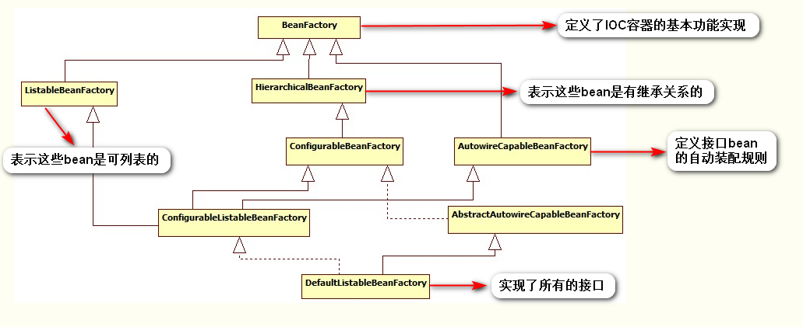
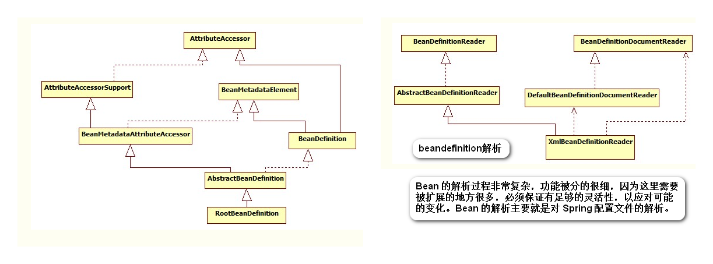

<p align="center"><font size="6">IoC</font></p>

&nbsp;&nbsp;&nbsp;&nbsp;&nbsp;&nbsp;&nbsp;&nbsp;IoC的全称是Inversion of Control，中文称为控制反转,Martin Flower又根据它创造了一个新词：Dependency Injection，中文称为依赖注入。这两个词讲的是一回事儿。

&nbsp;&nbsp;&nbsp;&nbsp;&nbsp;&nbsp;&nbsp;&nbsp;IoC的实质是如何管理对象，传统意义上我们使用new方式来创建对象，但在企业应用开发的过程中，大量的对象创建都在程序中维护很容易造成资源浪费，并且不利于程序的扩展。

&nbsp;&nbsp;&nbsp;&nbsp;&nbsp;&nbsp;&nbsp;&nbsp;<font color="red">IoC是Spring框架的核心。</font>

&nbsp;&nbsp;&nbsp;&nbsp;&nbsp;&nbsp;&nbsp;&nbsp;<font color="red">依赖注入和控制反转，目的是为了使类与类之间解耦合，提高系。统的可扩展性和可维护性。

&nbsp;&nbsp;&nbsp;&nbsp;&nbsp;&nbsp;&nbsp;&nbsp;</font><font color="yellow">我们可以从以下几个方面理解：</font>

* <font color="yellow">a、参与者都有谁？</font>
  
* <font color="yellow">b、依赖：谁依赖谁？为什么需要依赖？</font>
  
* <font color="yellow">c、注入：谁注入谁？又注入了什么呢？</font>
  
* <font color="yellow">d、控制反转：谁控制谁？控制什么？为什么叫反转呢？存在正转嘛？</font>
  
* <font color="yellow">e、控制反转和依赖注入是同一概念吗？</font>
  
&nbsp;&nbsp;&nbsp;&nbsp;&nbsp;&nbsp;&nbsp;&nbsp;我们需要弄明白上面的问题，这样对于控制反转和依赖注入的理解由大大的帮助。
  
&nbsp;&nbsp;&nbsp;&nbsp;&nbsp;&nbsp;&nbsp;&nbsp;<font color="red">第一个
问题：参与者都有谁？</font>
  
* **<font color="yellow">1）对象</font>**
* **<font color="yellow">2）IOC/DI容器</font>**
* **<font color="yellow">3）某个的对象的外部资源</font>**
  
&nbsp;&nbsp;&nbsp;&nbsp;&nbsp;&nbsp;&nbsp;&nbsp;<font color="red">第二个
问题：依赖，谁依赖谁？为什么需要依赖？</font>

* **<font color="yellow">对象依赖IOC/DI容器。</font>**
  
* **<font color="yellow">对象需要IOC/DI容器来提供对象需要的外部资源。</font>**

&nbsp;&nbsp;&nbsp;&nbsp;&nbsp;&nbsp;&nbsp;&nbsp;<font color="red">第三个
问题：注入，谁注入谁？又注入了什么呢？</font>

* **<font color="yellow">IOC/DI容器注入对象。**</font>

* **<font color="yellow">注入了对象所需要的资源。</font>**


&nbsp;&nbsp;&nbsp;&nbsp;&nbsp;&nbsp;&nbsp;&nbsp;<font color="red">第四个
问题：控制反转，谁控制谁？控制什么？为什么叫反转？有正转吗？</font>

* **<font color="yellow">IOC/DI容器控制对象，主要是控制对象实例的创建。</font>**

* **<font color="yellow">反转是相对于正向而言的,那么什么算是正向的呢？考虑一下常规情况下的应用程序，如果要在A里面使用C，你会怎么做呢？当然是直接去创建C的对象，也就是说，是在A类中主动去获取所需要的外部资源C，这种情况被称为正向的。那么什么是反向呢？就是A类不再主动去获取C，而是被动等待，等待IoC/DI的容器获取一个C的实例，然后反向的注入到A类中。</font>**

&nbsp;&nbsp;&nbsp;&nbsp;&nbsp;&nbsp;&nbsp;&nbsp;<font color="red">第五个
问题：控制反转和依赖注入是同一概念吗？ </font>

* **<font color="yellow">依赖注入和控制反转是对同一件事情的不同描述，从某个方面讲，就是它们描述的角度不同。依赖注入是从应用程序的角度在描述，可以把依赖注入描述完整点：应用程序依赖容器创建并注入它所需要的外部资源；而控制反转是从容器的角度在描述，描述完整点：容器控制应用程序，由容器反向的向应用程序注入应用程序所需要的外部资源。</font>**

&nbsp;&nbsp;&nbsp;&nbsp;&nbsp;&nbsp;&nbsp;&nbsp;实现依赖注入的三种方式：

* 1）利用接口或者继承，一般以接口较多。这种实现方式和我们平时提到的lazy load有异曲同工之妙。
* 2）构造函数注入。
* 3）属性注入。

* **<font color="yellow">A：接口注入</font>**

```
public class ClassA{
  private InterfaceB clzB;
  public void doSomething(){
    Object obj = Class.forName(Config.BImplementation);
    clzB = (InterfaceB)obj;
    clzB.doIt();
  }
  ......
}
```

&nbsp;&nbsp;&nbsp;&nbsp;&nbsp;&nbsp;&nbsp;&nbsp;<font color="red">代码解释：</font>

&nbsp;&nbsp;&nbsp;&nbsp;&nbsp;&nbsp;&nbsp;&nbsp;ClassA依赖于InterfaceB的实现，我们如何获得InterfaceB的实现实例呢？传统的方法是在代码中创建InterfaceB实现类的实例，并将赋予clzB.，这样一来，ClassA在编译期即依赖于InterfaceB的实现。为了将调用者与实现者在编译期分离。于是有了上面的代码。我们根据预先在设置文件中设定的实现类的类名(Config.Blmplementation)，动态加载实现类，并通过InterfaceB强制转型后为ClassA所用，这就是接口注入的一个最原始的雏形。

* **<font color="yellow">B：setter方法注入</font>**

&nbsp;&nbsp;&nbsp;&nbsp;&nbsp;&nbsp;&nbsp;&nbsp;setter注入模式在实际开发中有非常广泛的应用，setter方法更加直观。

```
<span style="font-family: 'Comic Sans MS';">
<span style="font-size: 18px;">
<?xml version="1.0" encoding="UTF-8"?>    
<beans xmlns="http://www.springframework.org/schema/beans"    
         xmlns:xsi="http://www.w3.org/2001/XMLSchema-instance"    
         xmlns:aop="http://www.springframework.org/schema/aop"    
         xmlns:tx="http://www.springframework.org/schema/tx"    
         xsi:schemaLocation="http://www.springframework.org/schema/beans 
         http://www.springframework.org/schema/beans/spring-beans-4.1.xsd    
         http://www.springframework.org/schema/aop 
         http://www.springframework.org/schema/aop/spring-aop-4.1.xsd    
         http://www.springframework.org/schema/tx 
         http://www.springframework.org/schema/tx/spring-tx-4.1.xsd">    
    
    <!-- 使用spring管理对象的创建，还有对象的依赖关系 -->    
    <bean id="userDao4Mysql" class="com.tgb.spring.dao.UserDao4MysqlImpl"/>    
    
    <bean id="userDao4Oracle" class="com.tgb.spring.dao.UserDao4OracleImpl"/>    
        
    <bean id="userManager" class="com.tgb.spring.manager.UserManagerImpl">    
        <!-- (1)userManager使用了userDao，Ioc是自动创建相应的UserDao实现，都是由容器管理-->    
        <!-- (2)在UserManager中提供构造函数，让spring将UserDao实现注入（DI）过来 -->    
        <!-- (3)让spring管理我们对象的创建和依赖关系，必须将依赖关系配置到spring的核心配置文件中 -->    
    
        <property name="userDao" ref="userDao4Oracle"></property>    
    </bean>    
        
</beans>    
</span>
</span>  
```

&nbsp;&nbsp;&nbsp;&nbsp;&nbsp;&nbsp;&nbsp;&nbsp;setter表示依赖关系的写法：

```
<span style="font-family: 'Comic Sans MS';">
<span style="font-size: 18px;">
import com.tgb.spring.dao.UserDao;    
    
public class UserManagerImpl implements UserManager{    
    
    private UserDao userDao;    
    
    //使用设值方式赋值    
    public void setUserDao(UserDao userDao) {    
        this.userDao = userDao;    
    }    
        
    @Override    
    public void addUser(String userName, String password) {    
    
        userDao.addUser(userName, password);    
    }    
}    
</span>
</span> 
```


* **<font color="yellow">C：构造器注入</font>**

&nbsp;&nbsp;&nbsp;&nbsp;&nbsp;&nbsp;&nbsp;&nbsp;构造器注入，即通过构造函数完成依赖关系的设定。下面是spring的配置文件：

```
<span style="font-size: 18px;"> 
<?xml version="1.0" encoding="UTF-8"?>    
    <beans xmlns="http://www.springframework.org/schema/beans"    
             xmlns:xsi="http://www.w3.org/2001/XMLSchema-instance"    
             xmlns:aop="http://www.springframework.org/schema/aop"    
             xmlns:tx="http://www.springframework.org/schema/tx"    
             xsi:schemaLocation="http://www.springframework.org/schema/beans 
             http://www.springframework.org/schema/beans/spring-beans-4.1.xsd    
             http://www.springframework.org/schema/aop 
             http://www.springframework.org/schema/aop/spring-aop-4.1.xsd    
             http://www.springframework.org/schema/tx 
             http://www.springframework.org/schema/tx/spring-tx-4.1.xsd">    
        
        <!-- 使用spring管理对象的创建，还有对象的依赖关系 -->    
        <bean id="userDao4Mysql" class="com.tgb.spring.dao.UserDao4MysqlImpl"/>    
        
        <bean id="userDao4Oracle" class="com.tgb.spring.dao.UserDao4OracleImpl"/>    
            
        <bean id="userManager" class="com.tgb.spring.manager.UserManagerImpl">    
            <!-- (1)userManager使用了userDao，Ioc是自动创建相应的UserDao实现，都是由容器管理-->    
            <!-- (2)在UserManager中提供构造函数，让spring将UserDao实现注入（DI）过来 -->    
            <!-- (3)让spring管理我们对象的创建和依赖关系，必须将依赖关系配置到spring的核心配置文件中 -->    
        
            <constructor-arg ref="userDao4Oracle"/>    
        </bean>    
            
    </beans>    
</span> 
```

&nbsp;&nbsp;&nbsp;&nbsp;&nbsp;&nbsp;&nbsp;&nbsp;构造器表示依赖关系的写法，代码如下所示：

```
<span style="font-size: 18px;"> 
import com.tgb.spring.dao.UserDao;    
        
    public class UserManagerImpl implements UserManager{    
        
        private UserDao userDao;    
        
        //使用构造方式赋值    
        public UserManagerImpl(UserDao userDao) {    
            this.userDao = userDao;    
        }    
        
        @Override    
        public void addUser(String userName, String password) {    
        
            userDao.addUser(userName, password);    
        }    
    }    
</span> 
```

**<font color="red">三种注入方法的比较：</font>**

* A：接口注入

&nbsp;&nbsp;&nbsp;&nbsp;&nbsp;&nbsp;&nbsp;&nbsp;接口注入模式因为具备侵入行，它要求组件必须与特定的接口相关联，因此并不被看好，实际使用有限。

* B：Setter注入

&nbsp;&nbsp;&nbsp;&nbsp;&nbsp;&nbsp;&nbsp;&nbsp;对于习惯了传统javabean开发的程序员，通过setter方法设定依赖关系更加直观。如果依赖关系较为复杂，那么构造子注入模式的构造函数也会相当庞大，而此时设值注入模式则更为简洁。如果用到了第三方类库，可能要求我们的组件提供一个默认的构造函数，此时构造子注入模式也不适用。


* C：构造器注入

&nbsp;&nbsp;&nbsp;&nbsp;&nbsp;&nbsp;&nbsp;&nbsp;在构造期间完成一个完整的、合法的对象。所有依赖关系在构造函数中集中呈现。依赖关系在构造时由容器一次性设定，组件被创建之后一直处于相对“不变”的稳定状态。只有组件的创建者关心其内部依赖关系，对调用者而言，该依赖关系处于“黑盒”之中。

&nbsp;&nbsp;&nbsp;&nbsp;&nbsp;&nbsp;&nbsp;&nbsp;Spring IOC体系结构

* 1）BeanFactory

&nbsp;&nbsp;&nbsp;&nbsp;&nbsp;&nbsp;&nbsp;&nbsp;Spring Bean的创建是典型的工厂模式，这一系列的Bean工厂，也即IOC容器为开发者管理对象间的依赖关系提供了很多便利和基础服务，在Spring中有许多的IOC容器的实现供用户选择和使用，其相互关系如下：




&nbsp;&nbsp;&nbsp;&nbsp;&nbsp;&nbsp;&nbsp;&nbsp;最基本的IOC容器接口BeanFactory

```
public interface BeanFactory {
	//对FactoryBean的转义定义，因为如果使用bean的名字检索FactoryBean得到的对象是工厂生成的对象，    
    //如果需要得到工厂本身，需要转义           
    String FACTORY_BEAN_PREFIX = "&"; 
       
    //根据bean的名字，获取在IOC容器中得到bean实例    
    Object getBean(String name) throws BeansException;    
  
   //根据bean的名字和Class类型来得到bean实例，增加了类型安全验证机制。    
    Object getBean(String name, Class requiredType) throws BeansException;    
   
   //提供对bean的检索，看看是否在IOC容器有这个名字的bean    
    boolean containsBean(String name);    
   
   //根据bean名字得到bean实例，并同时判断这个bean是不是单例    
   boolean isSingleton(String name) throws NoSuchBeanDefinitionException;    
   
   //得到bean实例的Class类型    
   Class getType(String name) throws NoSuchBeanDefinitionException;    
   
   //得到bean的别名，如果根据别名检索，那么其原名也会被检索出来    
  String[] getAliases(String name);    

}
```

* 2）BeanDefinition

&nbsp;&nbsp;&nbsp;&nbsp;&nbsp;&nbsp;&nbsp;&nbsp;SpringIOC容器管理了我们定义的各种Bean对象及其相互的关系，Bean对象在Spring实现中是以BeanDefinition来描述的，其继承体系如下：



&nbsp;&nbsp;&nbsp;&nbsp;&nbsp;&nbsp;&nbsp;&nbsp;IOC容器的初始化

&nbsp;&nbsp;&nbsp;&nbsp;&nbsp;&nbsp;&nbsp;&nbsp;IOC容器的初始化包括BeanDefinition的Resource定位、载入和注册这三个基本的过程。我们以ApplicationContext为例讲解，ApplicationContext系列容器也许是我们最熟悉的，因为web项目中使用的XmlWebApplicationContext就属于这个继承体系，还有ClasspathXmlApplicationContext等，其继承体系如下图所示：


* **<font color="yellow">XmlBeanFactory的整个流程</font>**

```
public class XmlBeanFactory extends DefaultListableBeanFactory{


     private final XmlBeanDefinitionReader reader; 
 

     public XmlBeanFactory(Resource resource)throws BeansException{
         this(resource, null);
     }
     

     public XmlBeanFactory(Resource resource, BeanFactory parentBeanFactory)
          throws BeansException{
         super(parentBeanFactory);
	 //this传递的是factory
         this.reader = new XmlBeanDefinitionReader(this);
         this.reader.loadBeanDefinitions(resource);
    }
 }
```

```
//根据Xml配置文件创建Resource资源对象，该对象中包含了BeanDefinition的信息
 ClassPathResource resource =new ClassPathResource("application-context.xml");
//创建DefaultListableBeanFactory
 DefaultListableBeanFactory factory =new DefaultListableBeanFactory();
//创建XmlBeanDefinitionReader读取器，用于载入BeanDefinition。之所以需要BeanFactory作为参数，是因为会将读取的信息回调配置给factory
 XmlBeanDefinitionReader reader =new XmlBeanDefinitionReader(factory);
//XmlBeanDefinitionReader执行载入BeanDefinition的方法，最后会完成Bean的载入和注册。完成后Bean就成功的放置到IOC容器当中，以后我们就可以从中取得Bean来使用
 reader.loadBeanDefinitions(resource);
```

* **<font color="yellow">FileSystemXmlApplicationContext的IOC流程</font>**

* * A：Application ac = new FileSystemXmlApplicationContext(xmlPath);
* * 调用构造函数：

```
/**
* Create a new FileSystemXmlApplicationContext, loading the definitions
* from the given XML files and automatically refreshing the context.
* @param configLocations array of file paths
* @throws BeansException if context creation failed
*/
 public FileSystemXmlApplicationContext(String... configLocations) throws BeansException {
        this(configLocations, true, null);
    }
```

* * 实际调用

```
public FileSystemXmlApplicationContext(String[] configLocations, boolean refresh, ApplicationContext parent)  
            throws BeansException {    
        super(parent);  
        setConfigLocations(configLocations);  
        if (refresh) {  
            refresh();  
        }  
    }
```

* * B：设置资源加载器和资源定位

* * &nbsp;&nbsp;&nbsp;&nbsp;&nbsp;&nbsp;&nbsp;&nbsp;通过分析FileSystemXmlApplicationContext的源代码可以知道，FileSystemXmlApplicationContext容器时，构造方法做以下两项：

* * * 1）首先，调用父类容器的构造方法(super(parent)方法)为容器设置好Bean资源加载器。
* * * 2）然后，再调用父类AbstractRefreshableConfigApplicationContext的setConfigLocations(configLocation)方法设置Bean定义资源文件的定位路径。通过追踪FileSystemXmlApplicationContext的继承体系，发现其父类的父类AbstractApplicationContext中初始化IOC容器所做的主要源码如下：

```
public abstract class AbstractApplicationContext extends DefaultResourceLoader  
        implements ConfigurableApplicationContext, DisposableBean {  
    //静态初始化块，在整个容器创建过程中只执行一次  
    static {  
        //为了避免应用程序在Weblogic8.1关闭时出现类加载异常加载问题，加载IoC容  
       //器关闭事件(ContextClosedEvent)类  
        ContextClosedEvent.class.getName();  
    }  
    //FileSystemXmlApplicationContext调用父类构造方法调用的就是该方法  
    public AbstractApplicationContext(ApplicationContext parent) {  
        this.parent = parent;  
        this.resourcePatternResolver = getResourcePatternResolver();  
    }  
    //获取一个Spring Source的加载器用于读入Spring Bean定义资源文件  
    protected ResourcePatternResolver getResourcePatternResolver() {  
        // AbstractApplicationContext继承DefaultResourceLoader，也是一个S 
        //Spring资源加载器，其getResource(String location)方法用于载入资源  
        return new PathMatchingResourcePatternResolver(this);  
    }   
……  
}
```
